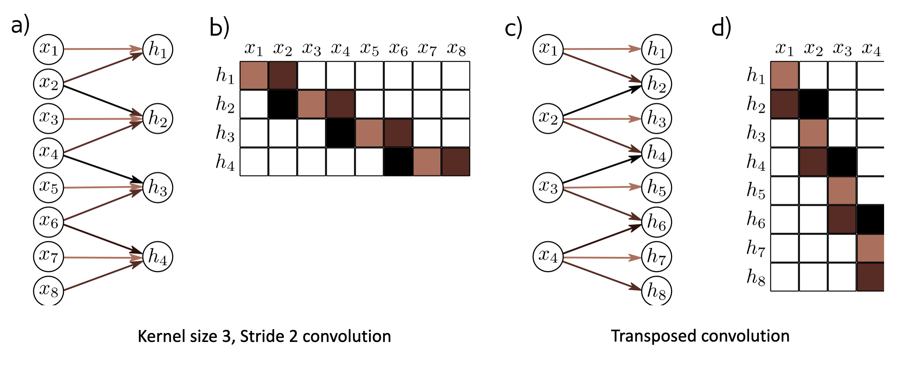

# Foundations of CNNs

Learn to implement the foundational layers of CNNs (pooling, convolutions) and to stack them properly in a deep network to solve multi-class image classification problems.

## Notes from "Understanding Deep Learning" Book

## Network for images
**Problems w Fully Connected Network**
- Size
  - 224 x 224 RGB Image = 150,528 dimensions
  - Hidden layer generally larger than input layer
  - One hidden layer = 150,528 x 150,528 = ~22 billion
- Nearby pixes are statistically related
  - FC does not have such concepts
  - But could permute pixels and relearn and get same results with FC
- Should be stable under Geometric Transformation
  - FC don't want to relearn appearance at different parts of image

## Invariance and Equivariance
- A function $f(x)$ is **invariance** to transformation $t(x)$ if $f(t(x)) = f(x)$
- In other words, the function output is the same after transformatio nis applied.
- *Image Classification*: we want our model to predict the same class even after transformation, e.g., shift, rotation, etc.
- A function $f(x)$ is **equivariance** to a transformation $t()$ if $f(t(x)) = t(f(x))$, i.e., the output is transformed in the same way as the input.
- *Image Segmentation*: Image has been translated, and we want the segmentation to translate with it.

## Convolution in 1D
- Input vector $\mathbf{x} = [x_1, x_2, ..., x_i]$
- Output is weighted sum of neighbor
- Convolution Kernel/Filter
  $z_i = w_1x_{i-1} + w_2x_{i} +w_3x_{i+1} $

  $\omega = [w_1, w_2, w_3]^{T}$

  Kernel Size = 3
  

## Special Case of Fully Connected Layer
**Convolution Layer**

$h_i = \text{a} [\beta + w_1x_{i-1} + w_2x_{i} +w_3x_{i+1}]$

$h_i = \text{a} [\beta + \sum\limits_{j = 1}^{3} w_jx_{i + j - 2}]$

Has 1 bias and 3 weights

**Fully Connected Layer**

$h_i = \text{a} [\beta_{i} + \sum\limits_{j = 1}^{D} w_{ij}x_j]$

Has $D$ biases and $D^2$ weights.


- a) fully connected layer
- b) Weight Matrix for (a)
- c) Convolutional Layer with kernel size = 3
- d) Weight Matrix for (c). Special case of fully connected layer, where many weights are zeros, and others are repeated.
- e) Convolution Layer with kernel size = 3 and stride = 2
- f) Weight Matrix for (e)

## Channels
- Convolution operation averages together the input
- Plus passes through ReLU function
- Has to loose information
- Solution
  - apply several convolutions and stack them as channels
  - sometimes also called feature maps

## Receptive Field
- The receptive field of a hidden unit is the region of the original input that feeds into it. 

- Consider a convolutional network where each convolutional layer has kernel
size three. 
- A hidden unit in first layer takes weighted sum of 3 nearby points in the input, so have receptive fields of size three. 
- The units in the second layer take a weighted sum of the three closest positions in the first layer, which are themselves weighted sums
of three inputs. Hence, the hidden units in the second layer have a receptive field of size five. 
- In this way, the receptive field of units in successive layers increases, and information from across the input is gradually integrated (figure 10.6).

## Downsampling & Upsampling

**Downsampling**


**Upsampling**


**Transpose Convolution**



- Transposed convolution in 1D. 
- a) Downsampling with kernel size = 3, stride = 2, and zero-padding. 
- b) This can be expressed by a weight matrix (same color indicates shared weight). 
- c) In transposed convolution, each input contributes three values to the output layer, which has twice as many outputs as inputs. 
- d) The associated weight matrix is the transpose of that in panel (b).

## Computer vision

- Computer vision is one of the applications that are rapidly active thanks to deep learning.
- Some of the applications of computer vision that are using deep learning includes:
  - Self driving cars.
  - Face recognition.
- Deep learning is also enabling new types of art to be created.
- Rapid changes to computer vision are making new applications that weren't possible a few years ago.
- Computer vision deep leaning techniques are always evolving making a new architectures which can help us in other areas other than computer vision.
  - For example, Andrew Ng took some ideas of computer vision and applied it in speech recognition.
- Examples of a computer vision problems includes:
  - Image classification.
  - Object detection: Detect object and localize them.
  - Neural style transfer: Changes the style of an image using another image.

  - 
  - 
- One of the challenges of computer vision problem that images can be so large and we want a fast and accurate algorithm to work with that.
  - For example, a `1000x1000` image will represent 3 million feature/input to the full connected neural network. If the following hidden layer contains 1000, then we will want to learn weights of the shape `[1000, 3 million]` which is 3 billion parameter only in the first layer and thats so computationally expensive and memory intensive!
  - Morevoer, such high-dimensional data risks overfitting, making traditional neural network methods infeasible.

- One of the solutions is to build this using **convolution layers** instead of the **fully connected layers**.

## Edge detection example

- The convolution operation is one of the fundamentals blocks of a CNN. One of the examples about convolution is the image edge detection operation.
- Early layers of CNN might detect edges then the middle layers will detect parts of objects and the later layers will put the these parts together to produce an output.
- In an image we can detect vertical edges, horizontal edges, or full edge detector.
- Vertical edge detection:
  - An example of convolution operation to detect vertical edges:
    
    
  
  - In the last example a `6x6` matrix convolved with `3x3` filter/kernel gives us a `4x4` matrix.
  - If you make the convolution operation in TensorFlow you will find the function `tf.nn.conv2d`. In keras you will find `Conv2d` function.
  - The vertical edge detection filter will find a `3x3` place in an image where there are a bright region followed by a dark region.
  - If we applied this filter to a white region followed by a dark region, it should find the edges in between the two colors as a positive value. But if we applied the same filter to a dark region followed by a white region it will give us negative values. To solve this we can use the abs function to make it positive.
- **Horizontal edge detection**. Filter would be like this
    $\begin{bmatrix}
    1 & 1 & 1\\
    0 & 0 & 0\\
    -1 & -1 & -1
    \end{bmatrix}
    $
 
- There are a lot of ways we can put number inside the horizontal or vertical edge detections. For example here are the vertical **Sobel** filter (The idea is taking care of the middle row):
    $\begin{bmatrix}
    1	&0&	-1\\
    2	&0&	-2\\
    1	&0&	-1\\    
    \end{bmatrix}
    $

- Also something called **Scharr** filter (The idea is taking great care of the middle row):
$\begin{bmatrix}
      3	&0&	-3\\
  10	&0&	-10\\
  3	&0&	-3\\
\end{bmatrix}
    $

- What we learned in the deep learning is that we don't need to hand craft these numbers, we can treat them as weights and then learn them. It can learn horizontal, vertical, angled, or any edge type automatically rather than getting them by hand.

* **What would happen if you used a larger filter size for edge detection?**

  Using a larger filter size for edge detection can have several effects:

  * **Increased Context**: A larger filter can capture more surrounding pixel information, which may help in detecting broader edges or features in the image. This can be beneficial for identifying larger objects or structures.

  * **Smoothing Effects**: Larger filters may introduce more smoothing, which can reduce noise but might also blur fine details. This can lead to the loss of smaller edges or features that are important for certain applications.

  * **Reduced Sensitivity**: With a larger filter, the sensitivity to small changes in pixel intensity may decrease. This means that subtle edges might not be detected as effectively, potentially missing important details in the image.

  * **Computational Cost**: Larger filters require more computations, which can increase processing time and resource usage, especially in real-time applications.


*  **What's an example of a situation where using a larger filter would be beneficial?**

      Using a larger filter can be particularly beneficial in situations where you need to detect broader features or structures in an image. Here are a couple of examples:

    * **Medical Imaging**: In medical imaging, such as MRI or CT scans, larger filters can help in identifying significant anatomical structures or abnormalities. For instance, detecting the outline of organs or tumors may require a broader context, which a larger filter can provide, helping to smooth out noise and highlight the overall shape.

    * **Satellite Imagery**: In satellite or aerial imagery, larger filters can be useful for detecting large geographical features, such as mountains, rivers, or urban areas. The broader context captured by a larger filter can help in distinguishing these significant features from the surrounding landscape, which may contain noise or smaller details that are not relevant for the analysis.
    
    In both cases, the use of a larger filter allows for a more generalized view of the image, making it easier to identify and analyze larger structures while reducing the impact of noise. 

## Padding
- Padding is used to maintain the original size of an image when applying convolutional filters, preventing the output from shrinking with each convolution.

- **General rule** -- if a matrix `nxn` is convolved with `fxf` filter/kernel, it gives us `(n-f+1) x (n-f+1)` matrix. Hence, the convolution operation shrinks the matrix if `f>1`.
- When we apply convolution operation multiple times, the image will shrinks and we will lose a lot of data on this process. Also the edges pixels are used less than other pixels in an image.
- So the problems with convolutions are:
  - Shrinks output.
  - throwing away a lot of information that are in the edges.

* By adding a border of pixels (usually zeros) around the image, you can ensure that edge pixels are utilized more effectively in the output.

* Types of Convolutions

  * **Valid Convolution**: This means no padding is applied, resulting in a smaller output size $(n - f + 1)$, where $n$ is image size and $f$ is filter size
  * **Same Convolution**: This involves padding the image so that the output size remains the same as the input size, achieved by calculating the appropriate padding based on the filter size.

* Choosing Filter Sizes
  * It is common practice to use odd-sized filters (e.g., 3x3, 5x5) in computer vision, as they allow for symmetric padding and a central pixel reference.
  * The padding required for same convolutions can be calculated as $\dfrac{(f - 1)} {2}$, ensuring the output size matches the input size.

* With padding, we get the final image with size of 

  $(n + 2p - f + 1) * (n + 2p - f + 1) = n * n$

  $(n + 2p - f + 1) = n$

  $p = (f - 1)/2$

  where, 
  * n is original image size
  * p is padding 
  * f is filter size

## Strided convolution

- Strided convolution is another piece that are used in CNNs. We will call stride `S`.

- Stride convolutions involve moving the filter over the input image by a specified number of steps (stride) rather than just one. 

- For example, a stride of `2` means the filter hops over two positions at a time.

- The formula for calculating the output size of a convolution is:
  
  $
  \text{output size} = \dfrac{n + 2p - f}{s} + 1
  $

  where:

  * $n$ = size of the input (image)
  * $p$ = padding applied to the input
  * $f$ = size of the filter (kernel)
  * $s$ = stride (the number of steps the filter moves)

- In case the result is a fraction, we take **floor** of this value.


- In math textbooks, the conv operation is flipping/mirroring the filter before using it. What we were doing is called cross-correlation operation but the state-of-art of deep learning is using this as conv operation.

- **Same Convolution** is a convolution with a padding so that output size is the same as the input size. Its given by the equation:

  $P = \dfrac{(n*s - n + f - s)}  {2}$, 
  when $s = 1$, $ P = \dfrac{(f-1)} {2}$
  
- **What is the significance of using a stride in convolutions?**

  Using a stride in convolutions has several significant effects:

  * *Control Over Output Size*: The stride determines how much the filter moves across the input image. A larger stride results in a smaller output size, while a smaller stride produces a larger output size. This allows you to control the dimensions of the output feature map.

  * *Computational Efficiency*: By increasing the stride, you reduce the number of positions the filter needs to compute, which can lead to faster processing times and lower computational costs. This is particularly useful in deep learning models where efficiency is crucial.

  * *Feature Extraction*: Strides can help in capturing features at different scales. A larger stride may skip some details, which can be beneficial for certain tasks where high-level features are more important than fine details.

  * *Downsampling*: Strides can act as a form of downsampling, reducing the spatial dimensions of the feature maps. This can help in reducing the complexity of the model and preventing overfitting.

  * **Overall**, the choice of stride is an important design decision in convolutional neural networks, impacting both the performance and efficiency of the model.

## Convolutions over Volumes

- We see how convolution works with 2D images, now lets see if we want to convolve 3D images (RGB image)
- We will convolve an image of height, width, # of channels with a filter of a height, width, same # of channels. Hint that the image number channels and the filter number of channels are the same.
- We can call this as stacked filters for each channel!
- Example:
  - Input image: `6x6x3`
  - Filter: `3x3x3`
  - Result image: `4x4x1`
  - In the last result p=0, s=1
- Hint the output here is only 2D.
- We can use multiple filters to detect multiple features or edges. Example.
  - Input image: `6x6x3`
  - 10 Filters: `3x3x3`
  - Result image: `4x4x10`
  - In the last result p=0, s=1

- **What is the significance of matching the number of channels in the image and filter?**  

  Matching the number of channels is vital for the convolution operation to function correctly (element-wise operations), enabling effective feature detection (allowing filters to analyze features across all channels) and preserving the integrity of the data as it flows through the neural network.

## One Layer of a Convolutional Network

- First we convolve some filters to a given input and then add a bias to each filter output and then get ReLU of the result. Example:
  - Input image: `6x6x3`         `# a0`
  - 10 Filters: `3x3x3`         `#W1`
  - Result image: `4x4x10`     `#W1a0`
  - Add b (bias) with `10x1` will get us : `4x4x10` image      `#W1a0 + b`
  - Apply RELU will get us: `4x4x10` image                `#A1 = RELU(W1a0 + b)`
  - In the last result p=0, s=1
  - Hint number of parameters here are: `(3x3x3x10) + 10 = 280`
- The last example forms a layer in the CNN.
- **Key Properties of Convolutional Networks**
  - Regardless of the inpute (image) size, Convolutional Layer maintains a fixed number of parameters, making them less prone to overfitting. This allows the same filters to detect features across large images efficiently. 
  - The number of parameters in a layer is determined by the size of the filters and the number of filters used. 


- **The role of bias in a convolutional layer**
  * **Offsets Activation**: Bias is added to the convolution output before activation, shifting the function to better fit the model.
  * **Improves Flexibility**: Allows the model to activate even when the weighted sum is zero.
  * **Enhances Learning**: Helps the network adjust outputs independently of inputs.
  * **Consistency Across Filters**: Each filter has its own bias, enabling unique feature detection.

- **What is the relationship between filter size and the number of parameters in a convolutional layer?**


  * *Filter Size*: Each filter in a convolutional layer has a specific size, typically defined as ( $f \times f \times d$ ), where ( $f$ ) is the height and width of the filter, and ( $d$ ) is the number of input channels.

  * *Parameters per Filter*: The number of parameters for a single filter is calculated as:

    $
    \text{Parameters per filter} = f \times f \times d + 1
    $

    (the "+1" accounts for the bias term).

  * *Total Parameters*: If there are ( $n$ ) filters in the layer, the total number of parameters in that convolutional layer is:

  $
  \text{Total parameters} = n \times (f \times f \times d + 1)
  $

## A simple convolution network example

- Lets build a big example.
  - Input Image are:   `a0 = 39x39x3`
    - `n0 = 39` and `nc0 = 3`
  - First layer (Conv layer):
    - `f1 = 3`, `s1 = 1`, and `p1 = 0`
    - `number of filters = 10`
    - Then output are `a1 = 37x37x10`
      - `n1 = 37` and `nc1 = 10`
  - Second layer (Conv layer):
    - `f2 = 5`, `s2 = 2`, `p2 = 0`
    - `number of filters = 20`
    - The output are `a2 = 17x17x20`
      - `n2 = 17`, `nc2 = 20`
    - Hint shrinking goes much faster because the stride is 2
  - Third layer (Conv layer):
    - `f3 = 5`, `s3 = 2`, `p3 = 0`
    - `number of filters = 40`
    - The output are `a3 = 7x7x40`
      - `n3 = 7`, `nc3 = 40`
  - Forth layer (Fully connected Softmax)
    - `a3 = 7x7x40 = 1960`  as a vector..
- In the last example you seen that the image are getting smaller after each layer and thats the trend now.
- Types of layer in a convolutional network:
  - Convolution. 		`#Conv`
  - Pooling      `#Pool`
  - Fully connected     `#FC`

## Pooling layers

- Other than the conv layers, CNNs often uses pooling layers to reduce the size of the inputs, speed up computation, and to make some of the features it detects more robust.
- Max pooling example:
  
  
  
  - This example has `f = 2`, `s = 2`, and `p = 0` hyperparameters
- The max pooling is saying, if the feature is detected anywhere in this filter then keep a high number. But the main reason why people are using pooling because its works well in practice and reduce computations.

- Max pooling retains the most prominent feature detected in a region by selecting the maximum value.

- Max pooling has no parameters to learn.
- Example of Max pooling on 3D input:
  - Input: `4x4x10`
  - `Max pooling size = 2` and `stride = 2`
  - Output: `2x2x10`
- Average pooling is taking the averages of the values instead of taking the max values.
- Max pooling is used more often than average pooling in practice.
- If stride of pooling equals the size, it will then apply the effect of shrinking.
- Hyperparameters summary
  - f : filter size.
  - s : stride.
  - Padding are rarely used here.
- The output size can be calculated using the formula:  
```
output_size = (n + 2p - f) / s + 1
```
- **Max vs Average Pooling**  
  * Max Pooling is better for retaining significant features and is often preferred in tasks where feature detection is crucial.
  * Average Pooling provides a more generalized view but may lose important details, making it less effective for certain applications.
  * In practice, max pooling is more commonly used in convolutional neural networks due to its effectiveness in preserving important features.

## Convolutional neural network example

- Now we will deal with a full CNN example. This example is something like the ***LeNet-5*** that was invented by Yann Lecun.
  - Input Image are:   `a0 = 32x32x3`
    - `n0 = 32` and `nc0 = 3`
  - First layer (Conv layer):        `#Conv1`
    - `f1 = 5`, `s1 = 1`, and `p1 = 0`
    - `number of filters = 6`
    - Then output are `a1 = 28x28x6`
      - `n1 = 28` and `nc1 = 6`
    - Then apply (Max pooling):         `#Pool1`
      - `f1p = 2`, and `s1p = 2`
      - The output are `a1 = 14x14x6`
  - Second layer (Conv layer):   `#Conv2`
    - `f2 = 5`, `s2 = 1`, `p2 = 0`
    - `number of filters = 16`
    - The output are `a2 = 10x10x16`
      - `n2 = 10`, `nc2 = 16`
    - Then apply (Max pooling):         `#Pool2`
      - `f2p = 2`, and `s2p = 2`
      - The output are `a2 = 5x5x16`
  - Third layer (Fully connected)   `#FC3`
    - Number of neurons are 120
    - The output `a3 = 120 x 1` . 400 came from `5x5x16`
  - Forth layer (Fully connected)  `#FC4`
    - Number of neurons are 84
    - The output `a4 = 84 x 1` .
  - Fifth layer (Softmax)
    - Number of neurons is 10 if we need to identify for example the 10 digits.
- Hint a Conv1 and Pool1 is treated as one layer.
- Some statistics about the last example:
  - 
- Hyperparameters are a lot. For choosing the value of each you should follow the guideline that we will discuss later or check the literature and takes some ideas and numbers from it.
- Usually the input size decreases over layers while the number of filters increases.
- A CNN usually consists of one or more convolution (Not just one as the shown examples) followed by a pooling.
- Fully connected layers has the most parameters in the network.
- To consider using these blocks together you should look at other working examples firsts to get some intuitions.

## Why convolutions?

* **Parameter Sharing**: Convolutional layers use the same filter across different parts of the image, reducing the number of parameters needed. For example, a 5x5 filter can detect features like edges in various locations without needing separate parameters for each position.

* **Sparsity of Connections**: Each output in a convolutional layer is only connected to a small region of the input, meaning that not all input pixels affect every output. This leads to fewer parameters and helps prevent overfitting.

## Training a Convolutional Neural Network**

* **Structure**: A typical convolutional neural network (CNN) consists of convolutional layers, pooling layers, and fully connected layers, followed by an output layer that predicts labels.

* **Cost Function and Optimization**: The cost function measures the difference between predicted and actual labels. Training involves optimizing the parameters using algorithms like gradient descent to minimize this cost.
  
  


<font color='blue'>
    
**What you should remember**:

* A convolution extracts features from an input image by taking the dot product between the input data and a 3D array of weights (the filter). 
* The 2D output of the convolution is called the feature map
* A convolution layer is where the filter slides over the image and computes the dot product 
    * This transforms the input volume into an output volume of different size 
* Zero padding helps keep more information at the image borders, and is helpful for building deeper networks, because you can build a CONV layer without shrinking the height and width of the volumes
* Pooling layers gradually reduce the height and width of the input by sliding a 2D window over each specified region, then summarizing the features in that region

<br><br>
<br><br>
These Notes were made by [Mahmoud Badry](mailto:mma18@fayoum.edu.eg) @2017 and revised by [Prakash Shrestha](prakash.public@gmail.com) @2024.
