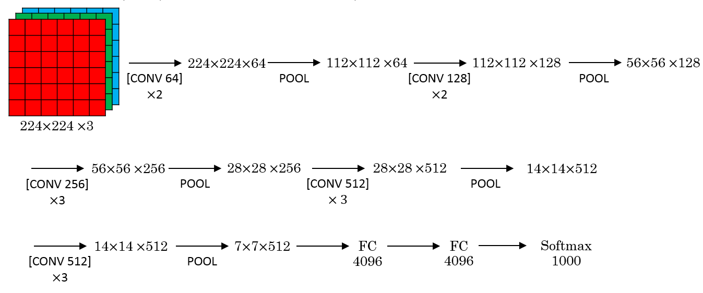
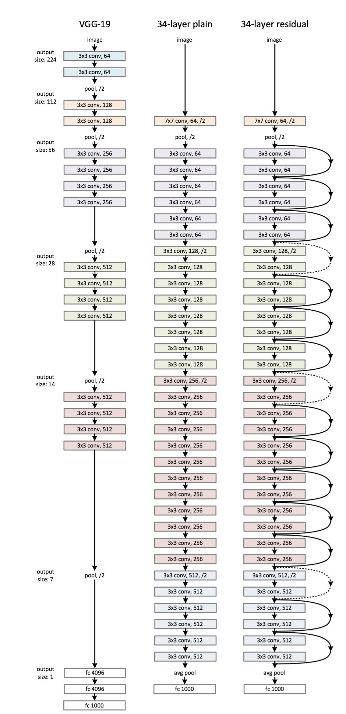
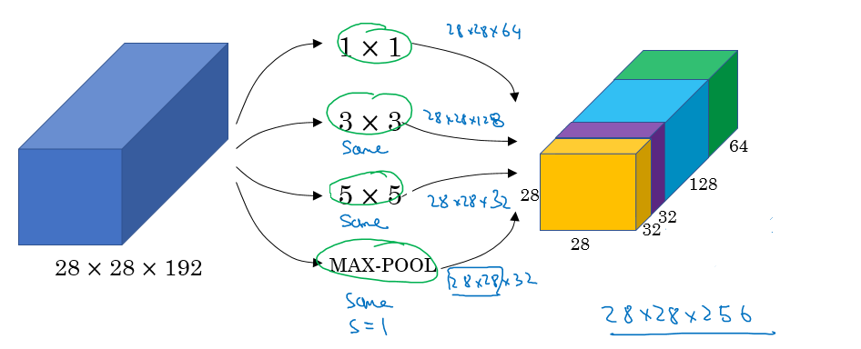
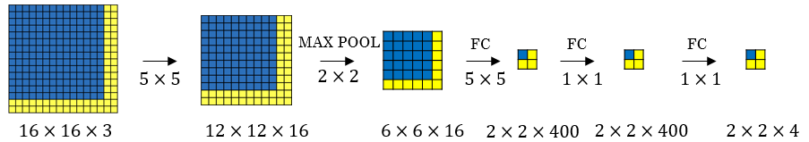

## Deep Convolutional Models: Case Studies

> Learn about the practical tricks and methods used in deep CNNs straight from the research papers -- this helps to gain intuition and confidence in building your own models.

## Table of contents

* [Deep convolutional models: case studies](#deep-convolutional-models-case-studies)
  * [Why look at case studies?](#why-look-at-case-studies)
  * [Classic networks](#classic-networks)
  * [Residual Networks (ResNets)](#residual-networks-resnets)
  * [Why ResNets work](#why-resnets-work)
  * [Network in Network and 1×1 convolutions](#network-in-network-and-1-X-1-convolutions)
  * [Inception network motivation](#inception-network-motivation)
  * [Inception network (GoogleNet)](#inception-network-googlenet)
  * [Using Open-Source Implementation](#using-open-source-implementation)
  * [Transfer Learning](#transfer-learning)
  * [Data Augmentation](#data-augmentation)
  * [State of Computer Vision](#state-of-computer-vision)
   

## Why look at case studies?

- We learned about Conv layer, pooling layer, and fully connected layers. It turns out that computer vision researchers spent the past few years on how to put these layers together.
- To get some intuitions and confidence on building your own models, you have to see the examples that has been made.
- Here are some classical CNN networks:
  - **LeNet-5**
  - **AlexNet**
  - **VGG**
- The best CNN architecture that won the last ImageNet competition is called **ResNet** and is popular for its depth (152 layers)!
- There are also an architecture called **Inception** that was made by Google that are very useful to learn and apply to your tasks.
- The principles from these case studies can be applied to various computer vision tasks, allowing you to adapt existing architectures to your specific problems, even in the discipline other than computer vision.

## Classic networks

- This section talks about classic networks -- **LeNet-5**, **AlexNet**, and **VGG**.

- **LeNet-5**

  - The goal for this model was to identify handwritten digits in a `32x32x1` gray image. Here are the drawing of it:
  <br>
  
  
  - This model was published in 1998. The last layer wasn't using softmax back then.
  - It has 60k parameters.
  - The dimensions of the image decreases as you go deeper to the network while the number of channels increases.
  - `Conv ==> Pool ==> Conv ==> Pool ==> FC ==> FC ==> softmax` this type of arrangement is quite common.
  - The activation function used in the paper was `Sigmoid` and `Tanh`. Modern implementation uses `ReLU` in most of the cases.
  - Back then, the activation used to be applied after pooling layer.
  - [[LeCun et al., 1998. Gradient-based learning applied to document recognition]](http://ieeexplore.ieee.org/document/726791/?reload=true)

- **AlexNet**

  - Named after Alex Krizhevsky who was the first author of this paper. The other authors includes Geoffrey Hinton.

  - The goal for the model was the ImageNet challenge which classifies images into 1000 classes. Here are the drawing of the model:

    
  
  - Summary:

    ```
    Conv => Max-pool => Conv => Max-pool => Conv => Conv => Conv => Max-pool ==> Flatten ==> FC ==> FC ==> Softmax
    ```

  - Similar to LeNet-5 but bigger and has 60M parameter compared to 60k parameter of LeNet-5.

  - It used the RELU activation function.

  - The original paper contains Multiple GPUs and Local Response normalization (RN).

    - Multiple GPUs were used because the GPUs were not so fast back then.
    - Researchers proved that Local Response normalization doesn't help much so for now don't bother yourself for understanding or implementing it. 

  - This paper convinced the computer vision researchers that deep learning is so important.

  - [[Krizhevsky et al., 2012. ImageNet classification with deep convolutional neural networks]](https://papers.nips.cc/paper/4824-imagenet-classification-with-deep-convolutional-neural-networks.pdf)

- **VGG-16**

  - A modification for AlexNet. 
  - It simplifies the architecture by using only following blocks:
    - CONV = 3 X 3 filter, s = 1, same  
    - MAX-POOL = 2 X 2 , s = 2
  - Here are the architecture:
    
    
  
  - This network is large even by modern standards. It has around 138 million parameters.
    - Most of the parameters are in the fully connected layers.
  - It has a total memory of 96MB per image for only forward propagation!
    - Most memory are in the earlier layers.
  - Number of filters increases from 64 to 128 to 256 to 512. 512 was made twice.
  - Pooling was the only one who is responsible for shrinking the dimensions.
  - There are another version called **VGG-19** which is a bigger version. But most people uses the VGG-16 instead of the VGG-19 because it does the same.
  - VGG paper is attractive it tries to make some rules regarding using CNNs.
  - [[Simonyan & Zisserman 2015. Very deep convolutional networks for large-scale image recognition]](https://arxiv.org/abs/1409.1556)

## Residual Networks (ResNets)

- Very, very deep NNs are difficult to train because of vanishing and exploding gradients problems.
- This section focuses on ResNet and how it utilizes skip connections to effectively train very deep neurtal networks, overcomming aforementioned challenges.

- **Residual block**
  - ResNets are built out of some Residual blocks.
  - It consists of a main path where activations are processed through linear operations and ReLU non-linearity, along with a shortcut that adds the original activation to the output before applying ReLU.
  - Basically, they add a shortcut/skip connection before the second activation.
  
    
  
  - By stacking this block, you can effectively train a much deeper NNs.
  - [[He et al., 2015. Deep residual networks for image recognition]](https://arxiv.org/abs/1512.03385)
  - **Skip Connection:** skip some layer in NN and feeds the output of one layer as the input to the next layer (instead of only the next one)


- **Residual Network**
  - Are a NN formed by stacking Residual blocks.
  
    
  
  - These networks can go deeper without hurting the performance. 
  - In a normal NN - *Plain Networks* - the theory tells us that if we go deeper, we will get a better solution to our problem, but because of the vanishing and exploding gradients problems, the performance of the network suffers as it goes deeper. Thanks to Residual Network we can go deeper as we want now.
    
    

  - As can be seen in the figure above, unlike the Plain NN, the performance of ResNet increases as the network goes deeper.
  - Some people are trying to train 1000 layer now which isn't used in practice. 
  - [He et al., 2015. Deep residual networks for image recognition]


## Why ResNets Work?

- Lets see some example that illustrates why resNet work.

  - We have a big NN as the following:

    - `X --> Big NN --> a[l]`

  - Lets add two layers to this network as a residual block:

    - `X --> Big NN --> a[l] --> Layer1 --> Layer2 --> a[l+2]`
    - And a`[l]` has a direct connection to `a[l+2]` (skip connection)

  - Suppose we are using RELU activations. Then, 
      ```
      a[l+2] = g( z[l+2] + a[l] )
      	   = g( W[l+2] a[l+1] + b[l+2] + a[l] )
      ```

  - If we are using L2 regularization for example, this will tend to shrink value for `W[l+2]`. We can assume the same for `b[l+2]`. This might result in `W[l+2]` and `b[l+2]` to becoming zero.

  - Then `a[l+2] = g( a[l] ) = a[l]` with no negative values.

  - This show that identity function is easy for a residual block to learn. And that is why it can train deeper NNs.

  - Also, the two layers (Residual Block) that we added doesn't hurt the performance of big NN we made. The performance of the NN w/ Residual Block will be as good as the plain NN. 

  - In case of the Deep Plain NN w/o Residual Blocks, it becomes difficult to learn parameters (even the identity fxn) as you go deeper into the network, which is why a lot of layers end up making the result worse.

  - Hint: dimensions of z[l+2] and a[l] have to be the same in resNets. In case they have different dimensions, we can put a matrix parameters `Ws` (Which can be learned or fixed)

    - `a[l+2] = g( z[l+2] + Ws * a[l] )` # The added `Ws` should make the dimensions equal.
    - `Ws` can also be a zero padding.

- Using a skip-connection helps the gradient to backpropagate and thus helps you to train deeper networks

- Lets take a look at ResNet on images.

  - Here are the architecture of **ResNet-34**:
  <br>
    
  - All the 3x3 Conv are same Convs.
  - Keep it simple in design of the network.
  - spatial size /2 => # filters x2
  - No FC layers, No dropout is used.
  - Two main types of blocks are used in a ResNet, depending mainly on whether the input/output dimensions are same or different. You are going to implement both of them.
  - The dotted lines is the case when the dimensions are different. To solve them, they down-sample the input by 2 and then pad zeros to match the two dimensions. There's another trick which is called bottleneck which we will explore later.

- Useful concept (**Spectrum of Depth**):

  

  - Taken from [icml.cc/2016/tutorials/icml2016_tutorial_deep_residual_networks_kaiminghe.pdf](icml.cc/2016/tutorials/icml2016_tutorial_deep_residual_networks_kaiminghe.pdf)

## Residual Blocks Types

Two main types based on whether input/output dimensions are same or different.

- Identity Block:
  - Standard block used in ResNets where input activation (`a[l]`) has the same dimension as the output activation (say `a[l+2]`)
    
    
  
  - BatchNorm is added to speed up the training
  - The diagram shows the skip connection "skips over" 2 layers. The "skip over" layers can be greater than 3. 
- Convolutional Block:
  - Residual Block where input activation (`a[l]`) and output activation (say `a[l+2]`) do not match up.

    

  - It differs to Identity Block by a CONV2D layer in the shortcut path, which is used to resize the input dimension so that it matches with the output activations (plays role of matrix `Ws`)
  - CONV2D in the shortcut path doesn't use any non-linear activation as its main function here is to (learn linear fxn to) resize the input.
  <!-- - The conv can be bottleneck 1 x 1 conv -->

- **Benefits of ResNets**
  - ResNets enable the training of networks with over 100 layers, overcoming the limitations of plain networks where increasing depth can lead to worse training performance.
  - By using skip connections, ResNets maintain a decreasing training error even as the number of layers increases, making them effective for very deep networks.


## Network in Network (aka 1 X 1 Convolution)

- A 1 x 1 convolution, aka Network in Network, Pointwise Convolution, is so useful in many CNN models.

- What does a 1 X 1 convolution do? Isn't it just multiplying by a number?

  - Lets first consider an example:
    - Input: `6x6x1`
    - Conv: `1x1x1` one filter.        `# The 1 x 1 Conv`
    - Output: `6x6x1`
  - Another example:
    - Input: `6x6x32`
    - Conv: `1x1x32` 5 filters.     `# The 1 x 1 Conv`
    - Output: `6x6x5`

- The Network in Network is proposed in [Lin et al., 2013. Network in network]

- It has been used in a lot of modern CNN implementations like ResNet and Inception models.
- 1x1 Convolution plays a crucial role in reducing computation cost by 
  - *Reducing the number of channels*, which loweres the number of operations in subsequent convolutions.
  - *Providing computation efficiency* by operating on fewer channels.
  - *Enabling flexible network designs* that improve overall efficiency.
  - *Decreasing memory usage*, allowing for handling larger networks or data.
  - If the number of 1 x 1 Conv filters = the number of input channels, then output dimension will be the same as the input dimension. In such case, the 1 x 1 Conv will act like a non linearity. 

- Replace fully connected layers with 1 x 1 convolutions as Yann LeCun believes they are the same.

  > In Convolutional Nets, there is no such thing as "fully-connected layers". There are only convolution layers with 1x1 convolution kernels and a full connection table. [Yann LeCun](https://www.facebook.com/yann.lecun/posts/10152820758292143) 

- [[Lin et al., 2013. Network in network]](https://arxiv.org/abs/1312.4400)

## Inception Network Motivation
- When you design a CNN you have to decide all the layers yourself. Will you pick a 3 x 3 Conv or 5 x 5 Conv or maybe a max pooling layer. You have so many choices.
- What **inception** tells us is - why not use all of them at once?
- **Inception Module**, naive version:
    <br>
    
  - *Hint*: that max-pool are same here.
  - Input to the inception module are 28 x 28 x 192 and the output are 28 x 28 x 256
  
  - Inception Network typically consists of following components
    - 1 x 1 Convolution Path
    - 3 x 3 Convolution Path
    - 5 x 5 Convolution Path
    - Pooling Path
  
  - Above paths are applied in parallel and their outputs are concatenated. This parallel processing allows the network to learn and integrate multiple levels of abstraction in a computationally efficient manner.

  - We use all the Convs with different filter sizes and pools that we might want and will let the NN learn and decide which it want to use most.
  - Inception Network, aka GoogleNet was first introduced by [Szegedy et al. 2014. Going deeper with convolutions](https://arxiv.org/abs/1409.4842)

- **Computational Cost Problem in Inception Model**
   
  - If we just focus on a 5 x 5 Conv.
  - There are 32 same filters of 5 x 5, and the input are 28 x 28 x 192.
  - Output should be 28 x 28 x 32
  - The total number of multiplications needed here are:
    - Number of outputs * Filter size * Filter size * Input dimensions
    - Which equals: `28 * 28 * 32 * 5 * 5 * 192 = 120 Mil` 
    - 120 Mil multiply operation still a problem in the modern day computers.
  - Using a 1 x 1 convolution we can reduce 120 mil to just 12 mil. Lets see how.
- Using 1 X 1 convolution to reduce computational cost:
  
  - The new architecture are:
    - X0 shape is (28, 28, 192)
    - We then apply 16 (1 x 1 Convolution)
    - That produces X1 of shape (28, 28, 16)
      - Hint, we have reduced the dimensions here.
    - Then apply 32  (5 x 5 Convolution)
    - That produces X2 of shape (28, 28, 32)
  - Now lets calculate the number of multiplications:
    - For the first Conv: `28 * 28 * 16 * 1 * 1 * 192 = 2.5 Mil`
    - For the second Conv: `28 * 28 * 32 * 5 * 5 * 16 = 10 Mil`
    - So the total number are 12.5 Mil approx. which is so good compared to 120 Mil
  - A 1 x 1 Conv here is called Bottleneck `BN`.
  - It turns out that the 1 x 1 Conv won't hurt the performance.
  - **Inception module**, dimensions reduction version:
    
  
- Example of inception model in Keras:
<br>
  
  
## Inception Network (GoogleNet)

- The inception network consist of concatenated blocks of the Inception module.
- The name inception was taken from a *meme* image which was taken from **Inception movie**
- Here are the full model:
  - 
- Some times a Max-Pool block is used before the inception module to reduce the dimensions of the inputs.
- There are a 3 Sofmax branches at different positions to push the network toward its goal. and helps to ensure that the intermediate features are good enough to the network to learn and it turns out that softmax0 and sofmax1 gives regularization effect.
- Since the development of the Inception module, the authors and the others have built another versions of this network. Like inception v2, v3, and v4. Also there is a network that has used the inception module and the ResNet together.
- [[Szegedy et al., 2014, Going Deeper with Convolutions]](https://arxiv.org/abs/1409.4842)

## Why Inception Networks Work Well
- **Efficiency**: The use of 1x1 convolutions to reduce dimensionality before applying larger convolutions reduces computational cost and memory usage, making the network more efficient.
- **Multi-Scale Feature Extraction**: By combining features from different convolutional kernels, the Inception module captures information at multiple scales and levels of abstraction, improving the network’s ability to understand complex patterns.
- **Reduced Overfitting**: Global average pooling reduces the number of parameters compared to fully connected layers, helping to mitigate overfitting.
- **Deeper Architectures**: The design of the Inception module allows for deeper network architectures without a significant increase in computational cost, enabling the network to learn more complex features.

> **It turns out that a lot of these NN are difficult to replicated. because there are some details that may not presented on its papers. There are some other reasons like:**
>- **Learning decay.**
>- **Parameter tuning.**

## MobileNets
- A type of CNN architecture that allows for building and deploying NN that can operate effectively on devices with limited computational power, such as mobile devices, 
- It utilizes **Depthwise Separable Convolutions**.

- The architecture is particularly beneficial for applications in computer vision, where efficiency is crucial.

### Depthwise Separable Convolution

- It consists of two main steps: i) *depthwise convolution* and ii) *pointwise convolution*, which together reduce computational costs significantly compared to normal convolution.
  
  
  
- In the depthwise convolution, each input channel is convolved with its own filter, resulting in fewer multiplications than traditional convolution.

- **Computational Efficiency**

  - **Normal Convolution**
    - Consider an input `6x6x3` being convolved by 5 `3x3` filter
    - The output will be `4 x 4 x 5`
    - Computation cost is as shown in the figure below. It requires 2160 multiplications. 
    
      
    
  - **Depth Separable Convolution** 
    - **Depthwise Convolution**
      - Consider the same input as in normal convolution. However, we will use one `3 x 3` filter per channel.
      - The output now will be `4 x 4 x 3`. 
      - Computation cost is as shown in the figure below.  
      
  
    - **Pointwise Convolution**
      - Now applying 5 `1x1` convolutional filters to the output from Depthwise Convolution
      - The output will be `4 x 4 x 5`
      - The computational cost is as shown in the figure below. 
       <br>
       
  
  - **Cost Summary
    - Cost of Normal Convolution = 2160
    - Cost of Deptwise Seperable Convolution = 432 + 240 = 672
    - Cost of Depthwise Separable Convolution =  (0.31 x Cost of Normal Convolution)
    - General Eqn = $\dfrac{1}{n_{c'}} + \dfrac{1}{f^{2}}$
    - In general DNN, $n_{c'}$ will be large (say 512) and $f = 3$. Given this, 
      >Depthwise Separable Convolution will generally be ~10 times computationally cheaper compared to normal convolution.


- The normal convolution requires a high number of multiplications, while the depthwise separable convolution drastically reduces this number, making it about 31% as computationally expensive as the normal convolution in the example discussed.
- This efficiency allows for faster inference and is particularly useful in scenarios where computational resources are limited.

- [Howard et al., 2017, MobileNets: Efficient Convolutional Neural Networks for Mobile Vision Applications](https://arxiv.org/abs/1704.04861)

## Transfer Learning in Computer Vision

- Transfer learning dramatically accelerates computer vision projects by leveraging pre-trained neural networks instead of training from scratch.  
- Publicly available datasets contain millions of labeled images used to train powerful models whose weights can be downloaded. These datasets are substantial:

  * **ImageNet:** A massive image database organized hierarchically according to WordNet (nouns), with hundreds or thousands of images per node.
  * **Microsoft COCO (Common Objects in Context):**  Features 2.5 million labeled instances of 91 object types across 328,000 images.
  * **PASCAL-Context:** Extends the PASCAL VOC 2010 dataset with whole-scene annotations, encompassing over 400 labels.

- Training these networks from scratch is computationally expensive, often requiring weeks and multiple GPUs.  Transfer learning bypasses this by utilizing the pre-trained weights as a starting point.

- **Practical Application:**

  Suppose you're building a cat detector for your cats, `Tigger` and `Misty`, with limited photos.  You can:

  1. **Download:** Obtain an open-source neural network pre-trained on a large dataset.
  2. **Replace Softmax:** Remove the original softmax layer (which outputs the original network's classifications).
  3. **Add Custom Softmax:** Add a new softmax layer designed for your specific classes: "Tigger," "Misty," or "neither."
  4. **Freeze Layers:** Freeze the weights of the pre-trained layers; only train the parameters of the new softmax layer.  For efficiency, pre-compute and save activations from the frozen layers to avoid redundant calculations during training.

- **Adapting to Data Size:**

  * **Small Dataset:** Freeze most layers, training only the new softmax layer.
  * **Larger Dataset:** Unfreeze and train more layers from the pre-trained network.
  * **Massive Dataset:** Use the pre-trained weights solely as initialization for training the entire network.

Transfer learning is highly advantageous in computer vision due to the availability of large datasets and the significant computational cost of training from scratch. It's the recommended approach unless you have an exceptionally large, unique dataset and extensive computational resources.

## Data Augmentation
- If data is increased, your deep NN will perform better. Data augmentation is one of the techniques that deep learning uses to increase the performance of deep NN.

- While other domains may reach data sufficiency, computer vision consistently benefits from increased data.  
- This is achieved by artificially expanding the dataset through various transformations applied to existing images.

- **Common data augmentation techniques include:**

  * **Mirroring (Horizontal/Vertical):** Flipping an image horizontally (or vertically) creates a mirrored version while often preserving the object or feature of interest.

  * **Random Cropping:**  Extracting random crops from images.  It's crucial to ensure these crops retain significant portions of the original image's content.

  * **Rotation, Shearing, and Local Warping:** These techniques involve rotating, shearing, or applying localized distortions to the image.  While useful, they are sometimes less frequently employed due to increased complexity.

  * **Color Shifting:**  Distorting the R, G, and B color channels.  This enhances robustness to variations in image color.  A sophisticated method, PCA Color Augmentation (detailed in the AlexNet paper), uses Principal Component Analysis (PCA) to adjust color channels based on the image's dominant tints.  For example, if an image is predominantly purple (red and blue), PCA augmentation will primarily adjust red and blue values while maintaining the overall color balance.

- **Implementation Tips:**

  - For efficient implementation, especially with large datasets, consider a parallel processing approach.  
    - A common strategy involves using one or more CPU threads dedicated to loading images and applying data augmentations.  
    - These augmented images are then passed to another thread or process (often a GPU) for model training. 
    - This allows data augmentation and training to occur concurrently.

  - Data augmentation, like other aspects of deep learning, involves hyperparameter tuning.  
    - the degree of color shifting or 
    - the size and randomness of cropping (need to be adjusted based on the specific dataset and model).  
  - Utilizing established open-source implementations offers a good starting point, followed by iterative fine-tuning to optimize performance.


- **In summary**, data augmentation is a powerful tool for enhancing the performance and robustness of computer vision models by effectively increasing the size and diversity of the training dataset.  

## State of Computer Vision

Computer vision tasks, like image recognition (identifying a cat in a picture) and object detection (locating and bounding objects like cars), have varying data availability.  Speech recognition has abundant data, image recognition moderate, and object detection relatively little.

**Specific Computer Vision Problems:**

* **Image recognition:**  Classifying an image (e.g., is this a cat?).
* **Object detection:** Locating and bounding objects within an image (e.g., identifying and boxing cars).  Object detection is more expensive to label due to the need for bounding boxes.


**Data vs. Hand-Engineering:**

- **Data abundance impacts the approach**:  lots of data allows for simpler algorithms and less "hand-engineering" (hacks) (carefully designing features and network architectures).  
- Limited data necessitates more hand-engineering and complex network architectures to compensate.  
- Computer vision, historically data-poor, relies heavily on this hand-engineering, leading to sophisticated but often computationally expensive architectures. 
- Although datasets are growing, the need for hand-engineering persists, particularly in network architecture and hyperparameter choices.
- Object detection algorithms, in particular, tend to be more complex and specialized. 
- Transfer learning is a valuable technique when data is scarce.


**Tips for Benchmarking and Competitions (but often not production):**

* **Ensembling:** Training multiple networks independently and averaging their outputs. This can yield a small performance improvement (1-2%), beneficial for competitions but often impractical for production due to increased computational cost (running time slowed by a factor of 3-15), memory usage (storing multiple models), and complexity.

* **Multi-crop at test time:** Running a classifier on multiple versions of test images and averaging results (e.g., the "10 crops" technique).  While improving results, this also increases processing time.  More useful for benchmarks than production systems.


<br><br>
<br><br>
These Notes were made by [Mahmoud Badry](mailto:mma18@fayoum.edu.eg) @2017 and revised by [Prakash Shrestha](mailto:prakash.public@gmail.com) @2024.
