# Week 3: Object detection
- [Learning Objectives](#learning-objectives-2)
- [Detection algorithms](#detection-algorithms)
  - [Object Localization](#object-localization)
  - [Landmark Detection](#landmark-detection)
  - [Object Detection](#object-detection)
  - [Convolutional Implementation of Sliding Windows](#convolutional-implementation-of-sliding-windows)
  - [Bounding Box Predictions (YOLO)](#bounding-box-predictions-yolo)
  - [Intersection Over Union](#intersection-over-union)
  - [Non-max Suppression](#non-max-suppression)
  - [Anchor Boxes](#anchor-boxes)
  - [YOLO Algorithm](#yolo-algorithm)
  - [(Optional) Region Proposals](#optional-region-proposals)
  
## Learning Objectives

- Describe the challenges of Object Localization, Object Detection and Landmark Finding
- Implement non-max suppression to increase accuracy
- Implement intersection over union
- Label a dataset for an object detection application
- Identify the components used for object detection (landmark, anchor, bounding box, grid, ...) and their purpose

## Detection Algorithms

### Object Localization

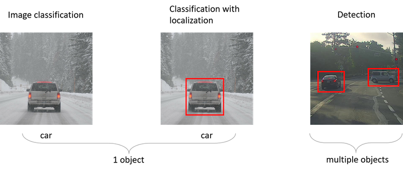

- **Image Classification** classifies an image to a specific class. The whole image represents one class. We don't want to know exactly where are the object. Usually only one object is presented.
- **Classification with localization** not only classify an image, but also the location of the class, defined by a rectangular bounding box.

- **Object Detection** extends image classification with localization to scenarios where we want to detect multiple objects in the image that belong to a specific classes and give their location. An image can contain more than one object with different classes.

- The ideas you learn about image classification will be useful for classification with localization, and the ideas you learn for localization will be useful for detection.

- To localize an object within an image:
  - ConvNet used for classification can be adapted to output additional parameters that define a bounding box around the recognized object, specifically parameters, `bx, by, bh` and `bw`.
  - The image’s top left is considered coordinate (0,0), and the bottom right is (1,1). Using this, the midpoint, height, and width of the bounding box can be defined.

  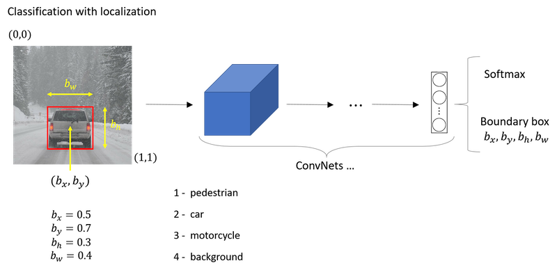

  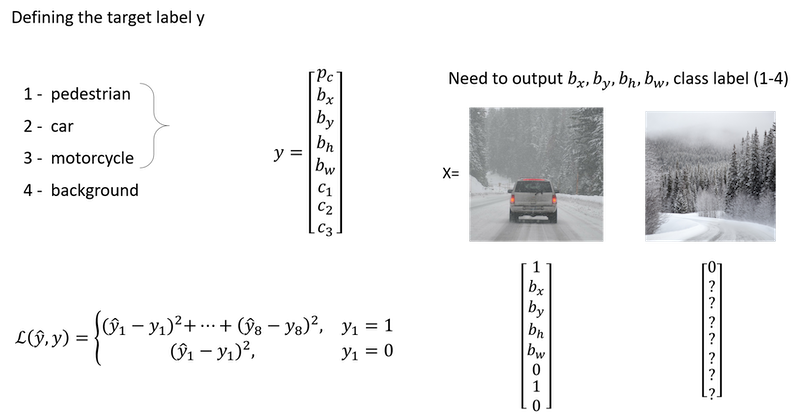

- On the topic of loss functions:
  - If an object is present (`y1 = 1`), the loss is the squared difference between the predicted and actual values across all components.
  - If no object is detected (`y1 = 0`), only the accuracy of `pc` is considered.

### Landmark Detection

- **Purpose**: Neural networks can be trained to detect specific points, or landmarks, on images. These landmarks help in applications like face recognition, emotion detection, and augmented reality effects.

- In more general cases, you can have a neural network just output x and y coordinates of important points in image, sometimes called landmarks.

  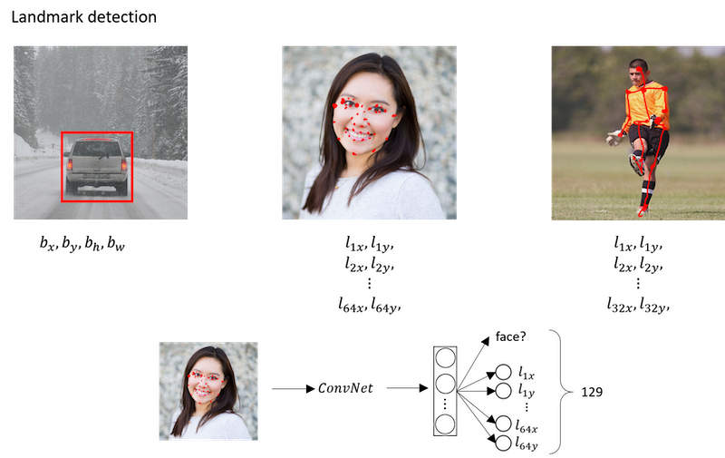

- If you are interested in people pose detection, you could also define a few key positions like the midpoint of the chest, the left shoulder, left elbow, the wrist, and so on.

- The identity of landmark one must be consistent across different images like maybe landmark one is always this corner of the eye, landmark two is always this corner of the eye, landmark three, landmark four, and so on.

### Object Detection

- **Goal**: Develop a car detection algorithm.
- **Training Set Creation**:
  - Obtain closely cropped images of cars, where the entire image mostly centers on the car.
  - The training set should contain positive examples (images with cars) and negative examples (images without cars).
- **CNN Training**:
  - Train a CNN using the cropped images to predict whether the input image has a car.
- **Sliding Windows Detection**:
  - Start with a test image.
  - Define a window size and slide it across the image at varying strides, cropping out portions to feed into the trained CNN.
  - For each cropped region, the CNN predicts whether it contains a car.
  - This process repeats with varying window sizes, ensuring various object scales are detected.

- **Challenges**:
  - Computational cost is significant due to the many cropped regions processed by the CNN.
  - Coarser strides may decrease computation but reduce accuracy. Finer strides increase accuracy but are computationally expensive.
  - Traditional methods using linear classifiers were more computationally efficient but less accurate than modern CNNs.
- **Solution**: Implement the Sliding Windows Object Detector more efficiently using convolutions.

  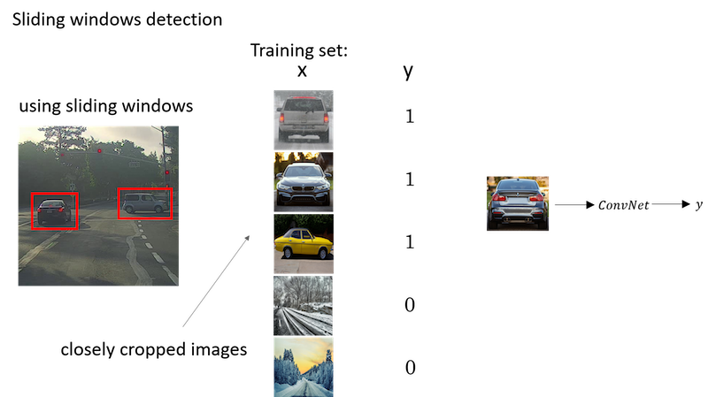

### Convolutional Implementation of Sliding Windows

- To build up towards the convolutional implementation of sliding windows let's first see how you can turn fully connected layers in neural network into convolutional layers.

- **Converting Fully Connected to Convolutional Layers**:
  - Traditional ConvNet is followed by a fully connected layers, which might connect to 400 units and then to another layer and finally output a probability distribution, `Y,` over four classes using a softmax layer.
  - To transform this into convolutional layers, you can think of the fully connected layers as 1x1 convolutions. Specifically, the first fully connected layer is equivalent to applying a 5x5x16 filter 400 times, leading to an output volume of 1x1x400. 
  - This operation is just like having 400 neurons in a fully connected layer, each looking at all the activations from the previous layer.
  - Subsequent fully connected layers can also be represented as 1x1 convolutional layers. For example, another 1x1 convolution can be used to get a 1x1x400 output again.

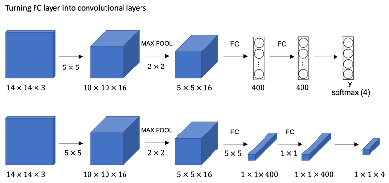

- In the traditional sliding windows algorithm, if you had a 16x16x3 image and wanted to detect objects in every possible 14x14 region, you’d run the CNN four times: once for each 14x14 region in the 16x16 image.
- This method is computationally expensive since there’s a lot of overlap between the regions. A significant portion of the computations are being repeated.
- Using the convolutional approach, instead of extracting and processing each region separately, you apply the CNN on the entire 16x16 image. When you do this, you get an output that’s larger than before, say 2x2x4 for our example.
- Each 1x1x4 slice of this output corresponds to the predictions for a different 14x14 region in the 16x16 image.
- When you use a larger image, say 28x28x3, this convolutional approach produces an 8x8x4 output, representing the predictions for many overlapping 14x14 regions. This is done without having to run the CNN multiple times on many different crops of the image.
- Essentially, by convolving the entire image at once, the computations for overlapping regions are shared, making the whole process much more efficient.

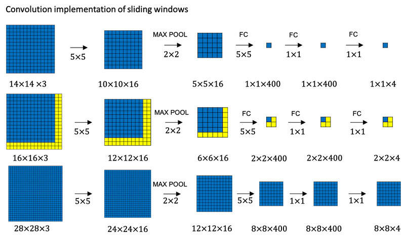

- However, there’s a challenge: the bounding boxes produced by this method might not be very precise.
- This convolutional implementation of sliding windows significantly boosts efficiency by eliminating redundant calculations, making real-time object detection more feasible.

### Bounding Box Predictions (YOLO)

The convolutional implementation of sliding windows is more computationally efficient, but it still has a problem of not quite outputting the most accurate bounding boxes. The perfect bounding box isn't even quite square, it's actually has a slightly wider rectangle or slightly horizontal aspect ratio.

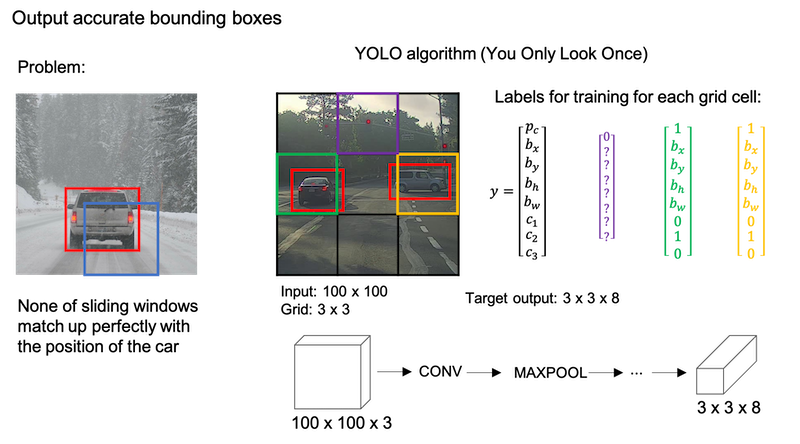

**YOLO algorithm**:

- **YOLO Introduction**: YOLO, stands for “You Only Look Once,” is an algorithm that allows for more precise bounding box predictions.

- **Grid-based Classification**: The idea is to overlay a grid on the image, and for each cell, predict if there’s an object and its associated bounding box. The object’s midpoint determines which grid cell is responsible for predicting it.

- **Label Vector Structure**: Each grid cell generates a vector `Y` containing:
  - `pc`: A binary value indicating the presence of an object.
  - Four values (`bx, by, bh, bw`) defining the bounding box.
  - Class probabilities for each possible object (e.g., pedestrian, car, motorcycle).

- **Training Process**: The neural network learns to map from an input image to an output volume where each slice is the vector `Y` for the corresponding grid cell.

- **Advantages of YOLO**
  - It can produce bounding boxes of various shapes.
  - It has a convolutional implementation, making it efficient and suitable for real-time object detection.
- **Bounding Box Encoding**: The bounding box is parameterized relative to the grid cell it’s in. Coordinates (`bx, by`) indicate the center of the bounding box, relative to the cell’s dimensions. The width (`bw`) and height (`bh`) are represented as fractions of the cell’s dimensions.

- **Next Steps**: There are additional techniques and modifications that can further enhance the YOLO algorithm, which will be discussed in subsequent content.

### Intersection Over Union

- `IoU` is a measure of the overlap between two bounding boxes. If we use `IoU` in the output assessment step, then the higher the `IoU` the more accurate the bounding box. However `IoU` is a nice tool for the YOLO algorithm to discard redundant bounding boxes.

  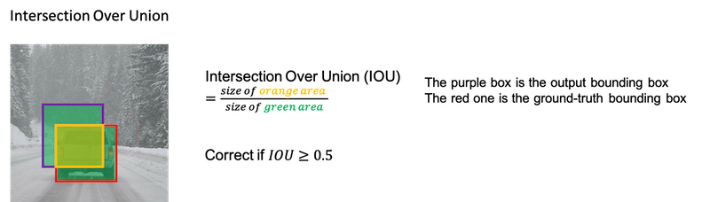

- **Purpose**: IoU serves as a measure to evaluate the effectiveness of object detection algorithms, especially regarding their localization accuracy.

- **Calculation**:
  - *Intersection*: The shared area between the ground-truth bounding box and the predicted bounding box.
  - *Union*: The area covered by either the ground-truth or the predicted bounding box or both.
  - *IoU Value*: Intersection/Union

- **Usage**:
  - Evaluating Localization Accuracy: Determine how many times the algorithm correctly detects and localizes an object based on set IoU thresholds.
  - Comparing Bounding Boxes: As a measure of similarity between two boxes.
- IoU is also crucial for “non-max suppression,” a technique to refine the outputs of the YOLO (You Only Look Once) object detection framework.

### Non-max Suppression

- **Problem:** One of the problems of Object Detection as you've learned about this so far, is that your algorithm may find multiple detections of the same objects. Rather than detecting an object just once, it might detect it multiple times. 
- **Solution:** Non-max suppression is a way for you to make sure that your algorithm detects each object only once.

- **Example**
  - **Context**: Suppose we are detecting pedestrians, cars, and motorcycles in an image with a 19x19 grid overlay.

  - **Issue:** Even though a car may technically lie within one grid cell, multiple neighboring cells might also claim they detected the same car due to the algorithm’s localization process. This results in multiple bounding boxes for the same object.

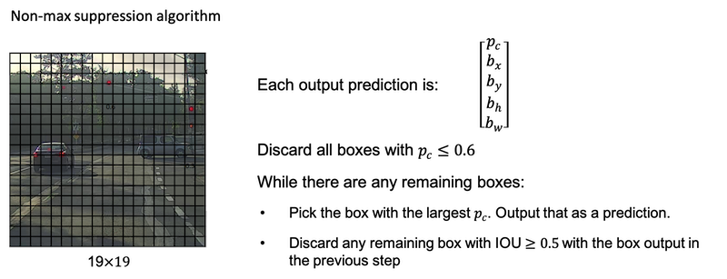

If you actually tried to detect three objects say pedestrians, cars, and motorcycles, then the output vector will have three additional components. And it turns out, the right thing to do is to independently carry out non-max suppression three times, one on each of the outputs classes.

### Anchor Boxes

- **Problem Statement:** One of the problems with object detection as you have seen it so far is that each of the grid cells can detect only one object. What if a grid cell wants to detect multiple objects? This is what the idea of anchor boxes does.

- **Solution:** Anchor Boxes
  - Pre-defined shapes called anchor boxes allow grid cells to detect multiple objects.
  - Each object in an image gets associated with an anchor box that best represents its shape.

*Anchor box algorithm*:

| previous box | with two anchor boxes |
| :---- | :---- |
| Each object in training image is assigned to grid cell that contains that object’s midpoint. | Each object in training image is assigned to grid cell that contains object’s midpoint and anchor box for the grid cell with highest `IoU`. |
| Output `y`: `3x3x8` | Output `y`: `3x3x16` or `3x3x2x8` |

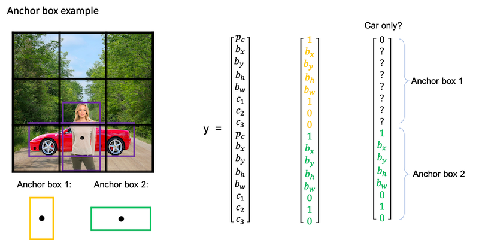

- **Potential Issues:**

  - Multiple Objects, Same Anchor Box: If two objects in a grid cell match the same anchor box shape, the system can’t handle it perfectly. A default tiebreaker or method needs to be implemented.

  - More Objects than Anchor Boxes: For instance, three objects in a grid cell but only two anchor boxes. Again, a default strategy or tiebreaker is required.

- **Why Use Anchor Boxes:**

  - Specialization: The algorithm can specialize in detecting objects of different shapes. For example, one set of outputs might become specialized in detecting tall, narrow objects, while another set focuses on wider objects.

  - Handling Overlaps: Even if overlaps in grid cells are rare (like in a 19x19 grid), anchor boxes help in such scenarios.

- **Choosing Anchor Boxes:**

  - Manual Selection: Initially, anchor boxes were hand-picked based on the variety of object shapes in the dataset.

  - Advanced Technique: Implement K-means clustering on the dataset shapes to select representative anchor boxes automatically.

- Anchor boxes improve the object detection capabilities of models like YOLO by allowing each grid cell to detect multiple objects of varying shapes.

### YOLO Algorithm

*YOLO algorithm steps*:

- If you're using two anchor boxes, then for each of the nine grid cells, you get two predicted bounding boxes.
- Next, you then get rid of the low probability predictions.
- And then finally if you have three classes you're trying to detect, you're trying to detect pedestrians, cars and motorcycles. What you do is, for each of the three classes, independently run non-max suppression for the objects that were predicted to come from that class.

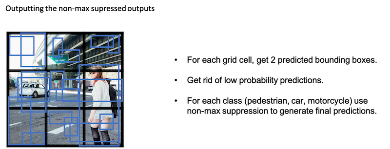

- **Advantages of YOLO:**
  - Speed: Because it processes the image in a single forward pass, YOLO is much faster than other object detection algorithms, making it suitable for real-time detection.
  - Global Context: As YOLO processes the entire image, it has a better context for detection, leading to fewer false positives in backgrounds.
- **Challenges with YOLO:**
  - **Handling overlapping objects**: Since each grid cell can predict only a fixed number of boxes (equal to the number of anchor boxes), YOLO might struggle with overlapping objects.
  - **Fine-grained detection:** If there are many small objects in close proximity, YOLO might find it challenging to detect all of them.

- The YOLO algorithm has seen several updates since its initial release. Each version comes with its own set of improvements in terms of speed, accuracy, and features. The foundational ideas remain consistent across versions, emphasizing end-to-end object detection in a single forward pass of the network.

### (Optional) Region Proposals

| algorithm | description |
| :----: | :---- |
| R-CNN | Propose regions. Classify proposed regions one at a time. Output label + bounding box. The way that they perform the region proposals is to run an algorithm called a segmentation algorithm. One downside of the R-CNN algorithm was that it is actually quite slow. |
| Fast R-CNN | Propose regions. Use convolution implementation of sliding windows to classify all the proposed regions. One of the problems of fast R-CNN algorithm is that the clustering step to propose the regions is still quite slow. |
| Faster R-CNN | Use convolutional network to propose regions. (Most implementations are usually still quit a bit slower than the YOLO algorithm.) |

### U-Net Architecture

#### Transpose Convolutional

- Is an upsampling layer that generates the output feature map greater than the input feature map. 
- They are particularly useful for tasks that involve upsampling the input data, such as 
  - converting a low-resolution image to a high-resolution one or 
  - generating an image from a set of noise vectors. 
  - image segmentation
- It performs the convolution operation in the opposite direction, i.e., instead of sliding the kernel over the input, it slides the input over the kernel and performs element-wise multiplication and summation. 
- This results in an output that is larger than the input, and the size of the output can be controlled by the stride and padding parameters of the layer.

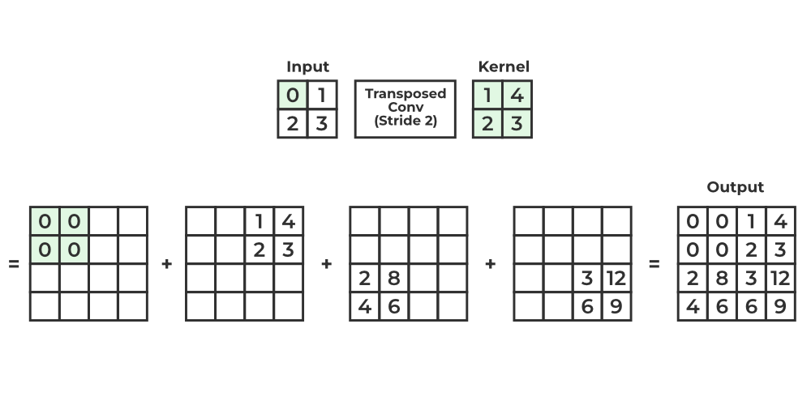

#### U-Net Architecture

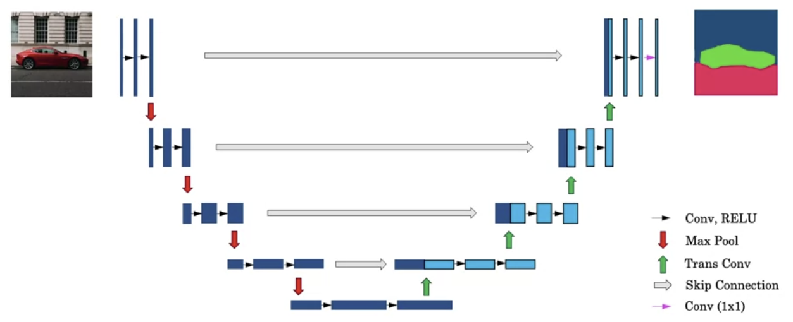

- The U-Net architecture is characterized by its U-shaped structure, which facilitates the process of image segmentation by combining downsampling and upsampling layers.
- The first part of the U-Net architecture uses normal convolutions to compress the input image, resulting in a smaller representation that loses some spatial information.
- The second half employs transposed convolutions to expand the representation back to the original image size, allowing for detailed pixel-level predictions.
- The Role of Skip Connections
  - Skip connections are introduced to link earlier layers to later layers, enabling the model to retain high-resolution, low-level feature information.
  - This combination of high-level contextual information and low-level detailed information helps the model make more accurate decisions about pixel classifications, such as identifying whether a pixel is part of a cat.
  - Skip connections are crucial as they allow the model to retain spatial information by copying activations from the downsampling path to the upsampling path.
  
- The output layer of the U-Net produces a segmentation map with dimensions matching the input image, where each pixel is associated with a vector representing class probabilities.
- By applying an arg max operation, the model classifies each pixel into one of the defined classes, resulting in a visual segmentation map.

Notes by Aaron @2020, Aman and revised by [Prakash Shrestha](prakash.public@gmail.com)

