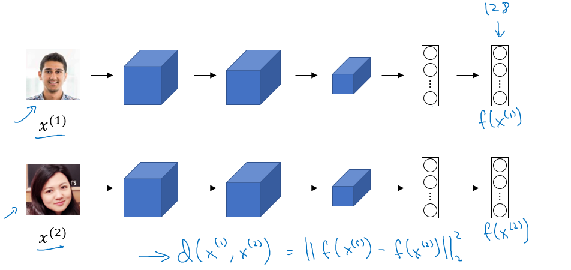

# Week 4: Special applications: Face recognition & Neural style transfer 
  
Discover how CNNs can be applied to multiple fields, including art generation and face recognition. Implement your own algorithm to generate art and recognize faces.

## Face Recognition

### What is face recognition
- Face recognition systems identify individuals using images or videos
- It can incorporate liveness detection to distinguish live humans from static images. 
- These systems are categorized into:

  - Face Verification (1:1)
    - Input Image, name/ID
    - Output whether the inpute image is that of the claimed person
  - Face Recognition (1:K)
    - Has a database of K persons
    - Get an input image
    - Output ID if the image is any of the K persons (or “not recognized”)

- High accuracy in face verification (≥99.9%) is essential to ensure reliable performance in face recognition systems.
- CNNs play a key role in both face recognition and applications like art generation

### One Shot Learning

- **Problem**: identify a person using just one image. 
- **Traditional Approach:** 
  - feed in the input image of the person to a ConvNet. 
  - and have it output a label, $y$, using a softmax unit with 4 (or 5) outputs corresponding to each of these four persons or none of the above. 
  - However, this doesn't work well.
- Traditional deep learning struggles with limited data, so instead, a similarity function is used to compare two images.

- The function calculates the degree of difference ( = 
`d(img1,img2)` between two images.
- If the difference is below a threshold ($\tau$), the images are classified as the same person.
- This method is robust, allowing new people to be added to the system easily without retraining.
- By learning this similarity function, face recognition systems can effectively address the one-shot learning challenge.

### Siamese network

A good way to implement a *similarity function* `d(img1, img2)` is to use a [Siamese network](https://www.paperswithcode.com/method/siamese-network).



- In a Siamese network, instead of making a classification by a softmax unit, we focus on the vector computed by a fully connected layer as an encoding of the input image `x1`.

*Goal of learning*:
- Parameters of NN define an encoding `𝑓(𝑥_𝑖)`
- Learn parameters so that: 
  - If `𝑥_𝑖,𝑥_𝑗` are the same person, `‖f(𝑥_𝑖)−f(𝑥_𝑗)‖^2` is small.
  - If `𝑥_𝑖,𝑥_𝑗` are different persons, `‖f(𝑥_𝑖)−f(𝑥_𝑗)‖^2` is large. 

### Triplet Loss
- Triplet Loss is a loss function used in Siamese networks to solve similarity distance problems.

- **Objective**: The goal is to minimize the distance between an Anchor (A) image and a Positive (P) image (same person) while maximizing the distance between the Anchor and a Negative (N) image (different person).

- Why "Triplet"? The name comes from comparing three images: Anchor, Positive, and Negative.

- We aim to ensure:  

  $||f(A) - f(P)||^2 \leq ||f(A) - f(N)||^2$

- To prevent trivial solutions (e.g., all distances being zero), we introduce a margin($\alpha$)

  $||f(A) - f(P)||^2 - ||f(A) - f(N)||^2 \leq -\alpha$
- Final formulation:
  
  $ L(A, P, N) = \max(||f(A) - f(P)||^2 - ||f(A) - f(N)||^2 + \alpha, 0) $

- Cost Function
$J = \Large\sum \large{L(A[i],P[i],N[i]}$

- **Dataset Requirements:**

  - Requires multiple images per person.
  - Triplets (A, P, N) should be chosen carefully to ensure meaningful training. - - Randomly selected triplets often satisfy constraints trivially and hinder learning.
  - Focus on hard triplets where the margin is challenging to satisfy, such as images with similar poses or conditions.

- **Training Notes:**

  - Commercial systems use large datasets (10-100 million images).
  - Pretrained models and parameters for face recognition are widely available.
  - For more details, refer to FaceNet: A Unified Embedding for Face Recognition and Clustering by Schroff et al. (2015).


### Face Verification and Binary Classification

- In addition to triplet loss, face recognition can be approached as a binary classification problem by learning a similarity function. Key points include:

  

- **Approach:**
  - The final layer of the neural network uses a sigmoid function to compute the similarity:  
    $Y' = w \cdot \sigma(f(x(i)) - f(x(j))) + b $, where the difference represents the Manhattan distance.
  - Other distance metrics, such as Euclidean or Chi-square, can also be used.
  - The network is **Siamese**, meaning it uses the same parameters for both input images.

- **Optimization Tip:**
  - Pre-compute the vectors - $f(x(j))$ for all comparison images.
  - For new images, compute $f(x(i))$ and compare it to the pre-computed vectors using the sigmoid function.

- **Performance:** This method performs comparably to the triplet loss function.

- **References and Tools:**
  - Refer to [DeepFace: Closing the Gap to Human-Level Performance](https://www.cv-foundation.org/openaccess/content_cvpr_2014/html/Taigman_DeepFace_Closing_the_2014_CVPR_paper.html) by Taigman et al., 2014.
  - Popular implementations include:
    - [OpenFace](https://cmusatyalab.github.io/openface/)
    - [FaceNet](https://github.com/davidsandberg/facenet)
    - [DeepFace](https://github.com/RiweiChen/DeepFace)


## Neural Style Transfer

### What is neural style transfer

- Neural style transfer is an application of convolutional networks (ConvNets). 
- It takes two inputs:
  - A content image (C),
  - A style image (S).

- The goal is to generate a new image (G) that combines the content of the first image with the style of the second image. 

  

- To achieve this, features are extracted from both shallow and deep layers of a pre-trained convolutional network (e.g., VGG). 
- This technique uses transfer learning, where a network trained on one task is adapted for a new one.
- Paper: [A Neural Algorithm of Artistic Style](https://arxiv.org/abs/1508.06576)

  

### What are deep ConvNets learning

- Lets discuss what deep convolutional networks (ConvNets) learn at different layers, particularly how the complexity of features evolves from simple to more intricate patterns.

  

- **Visualizing Layer 1**

  - In the first layer of a ConvNet, hidden units primarily detect simple features such as edges and specific colors. For example, certain units may activate in response to vertical lines or particular shades.

  - By analyzing the image patches that maximize activation for these units, we can see their focus on basic visual elements.

- **Exploring Deeper Layers**

  - As we move to deeper layers, the hidden units begin to recognize more complex shapes and patterns. For instance, layer 2 units may respond to vertical textures or round shapes.
  - This progression continues in layer 3, where units start detecting more intricate features, such as specific textures or shapes associated with objects like cars or animals.

- **Complex Object Recognition**

  - In layers 4 and 5, the ConvNet identifies even more sophisticated patterns, including specific breeds of dogs or objects like keyboards and flowers.
  - This illustrates the journey from recognizing simple edges in layer 1 to complex objects in deeper layers, enhancing our understanding of how ConvNets process visual information.

- Paper: [Visualizing and Understanding Convolutional Networks](https://arxiv.org/abs/1311.2901)


### Cost Function

- The goal is to generate an image ( G ) from a content image ( C ) and a style image ( S ) by minimizing a cost function ( J(G) ).
- $$J(G) = \alpha * J(C,G) + \beta * J(S,G)$$
  
  - `J(C, G)`, content cost, measures how similar is the generated image (G) to the Content image (C).
  - `J(S, G)`, style cost measures how similar is the generated image (G) to the Style image (S).
  - $\alpha$ and $\beta$ are relative weighting  and these are hyperparameters.
    - It controls the balance between content and style in the generated image.

- **Gradient Descent Optimization**
  1. Initiate G randomly, e.g., G: 100 X 100 X 3
  2. Use gradient descent to minimize `J(G)`
    - `G = G - dG`  
    - We compute the gradient image and use gradient decent to minimize the cost function.
    
  - The iterations might be as following image:
    - To Generate this:
      
      
    
    - You will go through this:
    
      
 

### Content Cost Function

- Say you use hidden layer 𝑙 to compute content cost. 
- It's important to select a hidden layer that is neither too shallow nor too deep, typically somewhere in the middle of the neural network.

- A shallow layer will enforce pixel-level similarity, while a deeper layer will only ensure that key features (like objects) are present in both images.

- This choice allows for a balance between preserving fine details and maintaining overall content structure.
- Use pre-trained ConvNet. (E.g., VGG network)

- Let `𝑎[𝑙](𝐶)` and `𝑎[𝑙](𝐺)` be the activation of layer 𝑙 on the images   
- If `𝑎[𝑙](𝐶)` and `𝑎[𝑙](𝐺)` are similar, both images have similar content

  $J_{content}(C, G) = 1/2 * ‖𝑎[𝑙](𝐶)−𝑎[𝑙](𝐺)‖^2$

### Style Cost Function

Style is defined as correlation between activations across channels.


### 1D and 3D Generalizations

ConvNets can apply not just to 2D images but also to 1D data as well as to 3D data.

For 1D data, like ECG signal (electrocardiogram), it's a time series showing the voltage at each instant time. Maybe we have a 14 dimensional input. With 1D data applications, we actually use a recurrent neural network.

```
14 x 1 * 5 x 1 --> 10 x 16 (16 filters)
```

For 3D data, we can think the data has some height, some width, and then also some depth. For example, we want to apply a ConvNet to detect features in a 3D CT scan, for simplifying purpose, we have 14 x 14 x 14 input here. 

```
14 x 14 x 14 x 1 * 5 x 5 x 5 x 1 --> 10 x 10 x 10 x 16 (16 filters)
```

Other 3D data can be movie data where the different slices could be different slices in time through a movie. We could use ConvNets to detect motion or people taking actions in movies.

---
Notes by Aaron © 2020 and revised by [Prakash Shrestha](mailto:prakash.public@gmail.com)
