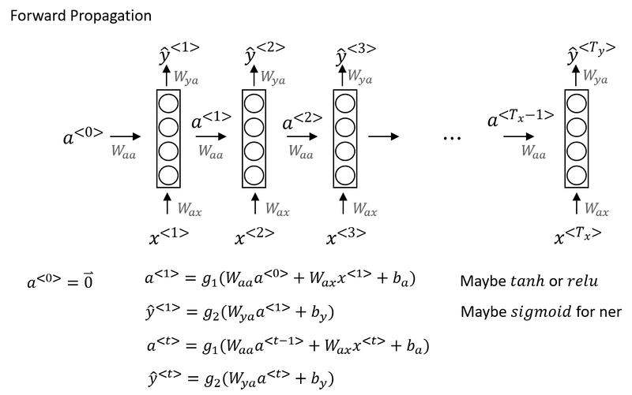
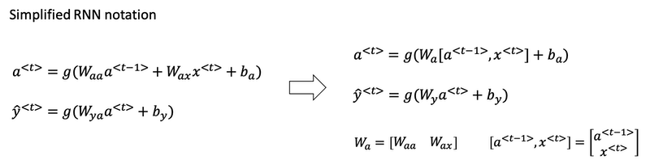
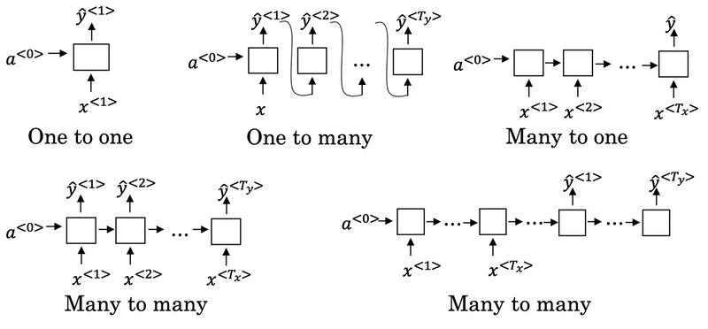
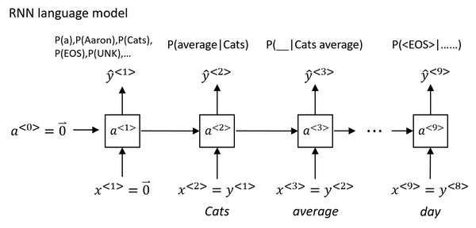
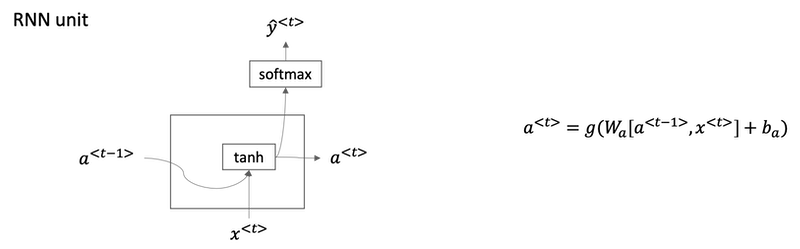

# Week 1: Recurrent Neural Network

>Recurrent neural networks has been proven to perform extremely well on temporal data. It has several variants including LSTMs, GRUs and Bidirectional RNNs.

## Why Sequence Models?

- Sequence Models like RNN and LSTMs have greatly transformed learning on sequences in the past few years.

- Examples of sequence data in applications:

  | **Application**            | **Type**             | **Input (X)**      | **Output(Y)**              |
  |----------------------------|----------------------|--------------------|----------------------------|
  | Speech Recognition         | Sequence-to-Sequence | Wave               | Text                       |
  | Music Generation           | One-to-Sequence      | Nothing or Integer | Wave                       |
  | Sentiment classification   | Sequence-to-One      | Text               | Integer Rating  from 1 - 5 |
  | DNA Sequence Analysis      | Sequence-to-Sequence | DNA Sequence       | DNA Labels                 |
  | Machine Translation        | Sequence-to-One      | Text               | Text                       |
  | Video Activity Recognition | Sequence-to-One      | Video Frames       | Label                      |
  | Name Entity Recognition    | Sequence-to-Sequence | Text               | Label                      |

- All of these problems with different input and output (sequence or not) can be addressed as supervised learning with label data X, Y as the training set.

## Why not a Standard Neural Network?
- **Variable Input and Output Lengths**
    - Standard NNs require fixed-size inputs/outputs.
    - However, in sequence tasks, the lengths of input/output can vary (e.g., sentences of different length) over examples, making it challenging to use a standard NN.
- **Lack of Contextual Awareness:**
    - Standard NN process inputs independently -- they cannot leverage the sequential context. For example, the meaning of word can depend on the words that come before or after it, which standard NN cannot capture.
- **Parameter Inefficiency**
    - A standard NN would require a large number of parameters to handle different input lengths, leading to inefficiency.
    - RNNs share parameters across time steps, reducing the number of parameters needed.

## Introduction to Recurrent Neural Networks

-   RNNs are designed to handle inputs and outputs of varying lengths, making them suitable for sequence learning tasks like name entity recognition.
-   Unlike standard NN, RNNs share parameters across time steps, allowing them to learn features that can generalize across different positions in the input sequence.

## Forward Propagation
-   In RNNs, each input word is processed sequentially, with the hidden state from the previous time step influencing the current prediction.
-   The activation function is applied to compute the hidden state and the output at each time step, using weights that are consistent across the sequence.

- In other words, the input sequence is processed from left to right, where each activation at a timestep depends on the previous activation and the input at that timestep.

-   The parameters used for these computations, such as weights and biases, remain constant across all timesteps.

    

    
- Instead of carrying around two parameter matrices Waa and Wax, we can simplifying the notation by compressing them into just one parameter matrix Wa.

    

**Limitations and Future Directions**
-   A key limitation of standard RNNs is their inability to utilize future context when making predictions, as they only consider past inputs.
-   This limitation can be addressed with bi-directional RNNs, allowing the model to incorporate information from both past and future inputs.

## Backpropagation Through Time (BPTT)

-   Backpropagation occurs in the opposite direction of forward propagation, moving from right to left through the network.
-   The overall loss for the sequence is calculated by summing the individual losses at each timestep, which is then used to update the parameters through gradient descent.

-   The term "backpropagation through time" describes this process, emphasizing the backward traversal through the sequence.
-   This method allows the network to learn from the entire sequence by adjusting weights based on the loss calculated at each timestep.

- **BPTT** is a specific method used to train RNNs. Here’s a concise breakdown:

    -   **Concept**: BPTT extends the standard backpropagation algorithm to handle the temporal aspect of RNNs. It allows the network to learn from sequences of data by considering the entire sequence during training.

    -   **Process**:  
        -   **Forward Pass**: The input sequence is processed from the first timestep to the last, generating activations and predictions at each timestep.
        -   **Loss Calculation**: After the forward pass, the loss is computed based on the predictions and the actual outputs at each time steps and summing them up.
        -   **Backward Pass**: The gradients of the loss with respect to the network's parameters are calculated by traversing back through the network, from the last timestep to the first. This involves accumulating gradients over all timesteps, allowing the model to learn from the entire sequence.
    -   **Purpose**: BPTT helps the RNN learn dependencies across time steps, making it effective for tasks like language modeling, where context from previous words influences the prediction of the next word.

## Different Types of RNNs
- There exists various architectures of RNNs that are  adjusted for different input and output sequence lengths.

- RNNs can have different configurations, such as many-to-many, many-to-one, one-to-many, and one-to-one, depending on the relationship between input and output sequences.

    

-  In `many-to-one` architecture, a sequence of words (input) can produce a single output, like a sentiment score for a movie review, e.g., sentiment classification.
-  In `one-to-many` architecture, e.g., music generation, it can take a single input (like a genre) and produce a sequence of musical notes.
- `Many-to-many` architectures can handle cases where the input and output lengths differ, such as in machine translation, where a sentence in one language may translate to a different number of words in another language.
    -   This involves an encoder-decoder structure, where the encoder processes the input sequence and the decoder generates the output sequence.

## Language Model and Sequence Generation

- A language model tells you what is the probability of a particular sentence.
- RNNs can be utilized to build effective language models in NLP.

- For example, we have two sentences from speech recognition application:

    | sentence | probability |
    | :---- | :---- |
    | The apple and pair salad. | 𝑃(The apple and pair salad)=3.2x10-13 |
    | The apple and pear salad. | 𝑃(The apple and pear salad)=5.7x10-10 |

- For language model it will be useful to represent a sentence as output `y` rather than inputs `x`. 

- So what the language model does is to estimate the probability of a particular sequence of words `𝑃(y<1>, y<2>, ..., y<T_y>)`.

    

**Understanding Language Models**

* A language model estimates the probability of a sequence of words, helping systems like speech recognition and machine translation determine the most likely sentence from similar-sounding options.
- For example, it can differentiate between "the apple and pair salad" and "the apple and pear salad" based on their probabilities.

**Building a Language Model with RNNs**

- To create a language model using an RNN, you need a large corpus of text, which is tokenized into a vocabulary, mapping words to one-hot vectors or indices.
- An end-of-sentence (EOS) token can be added to help the model understand when sentences conclude, although it may not be necessary for all applications.

**Training the RNN**

- The RNN processes the input sequence one word at a time, predicting the next word based on the previous words, and uses a Softmax function to output probabilities for each word in the vocabulary.

- The training involves defining a cost function based on the difference between the predicted and actual words, allowing the model to learn from its mistakes.

## Sampling Novel Sequences

After training a sequence model, you can evaluate its learning by generating novel sequences. Here's how to generate a sentence using an RNN language model:

**First Word Generation:**

- Use the softmax distribution to calculate probabilities for all possible first words (e.g., "a," "Aaron," "Zulu," <UNK>).
- Randomly sample the first word based on these probabilities using a method like `np.random.choice`.

**Subsequent Words:**

- Use the sampled word from the previous step as input to the next time step.
- Repeat the process to sample the next word until the <EOS> (end of sequence) token is generated or pre-specified number of words are generated.

**Avoiding <UNK> Tokens:**

- If <UNK> is sampled, reject it and resample until a valid word is selected.

This approach allows the model to generate sentences by sequentially sampling words based on learned probabilities.

#### Character Level Language Model

- A character-level language model generates sequences based on individual characters rather than whole words.

- **Advantages:**

  - Eliminates the need for an <UNK> token, as all characters are part of the vocabulary.

- **Disadvantages:**
  - Produces much longer sequences, making it harder to capture long-range dependencies in sentences.
  - More computationally expensive to train compared to word-level models.
  - While not as effective for capturing sentence-level context, character-level models are gaining interest in specific applications as computing power improves.

- **Character Level vs. Word Level Models**

    - A character level RNN uses individual characters as its vocabulary, allowing it to handle unknown words more effectively but resulting in longer sequences.
    - Word level models are generally more efficient for capturing long-range dependencies in sentences, while character level models can be more computationally expensive to train.

## Gated Recurrent Unit (GRU)
- Gated Recurrent Unit (GRU) is a modification of the basic RNN that enhances its ability to capture long-range dependencies and addresses the vanishing gradient problem.

    

<!-- Understanding the GRU Structure -->

- The GRU introduces a memory cell (C) that retains information, allowing the model to remember important details, such as whether a subject is singular or plural, throughout a sequence.
- The GRU uses an update gate (Γ_u) to determine when to update the memory cell, effectively controlling the flow of information.

**Key Equations and Operations**

- The candidate value for the memory cell (C~) is computed using the previous memory cell value and the current input, processed through an activation function.
- The update equation combines the candidate value and the previous memory cell value, allowing the model to either update or retain the memory based on the gate's output.

**Benefits of the GRU**

- The GRU is particularly effective at maintaining information over long sequences, which helps mitigate the vanishing gradient problem.
- It allows for selective memory updates, enabling the model to focus on relevant information while ignoring less important details.
