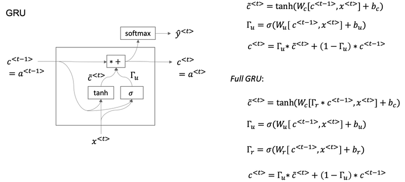
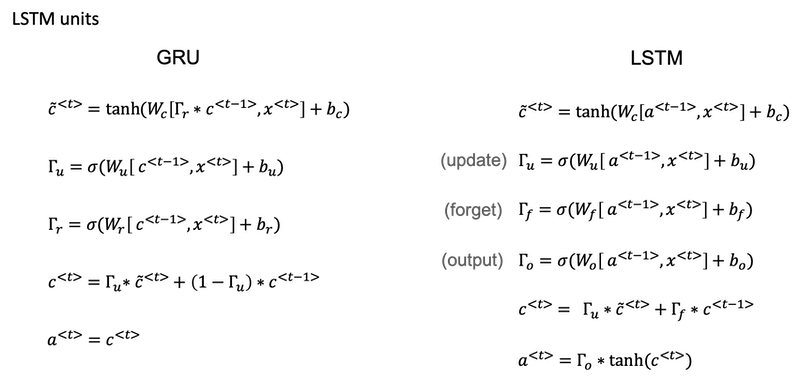
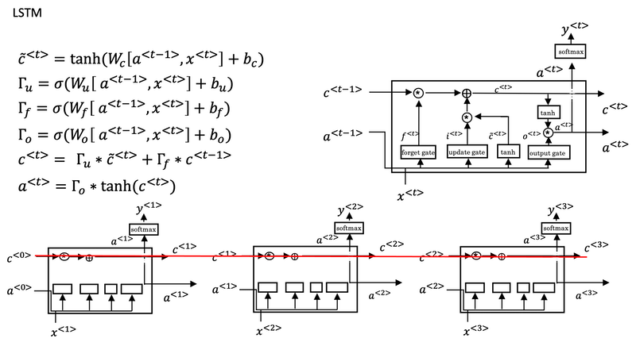
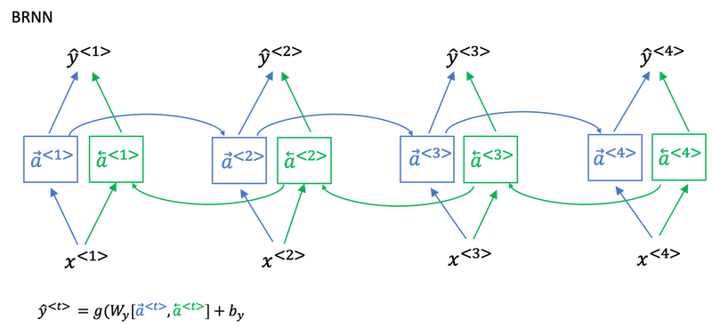
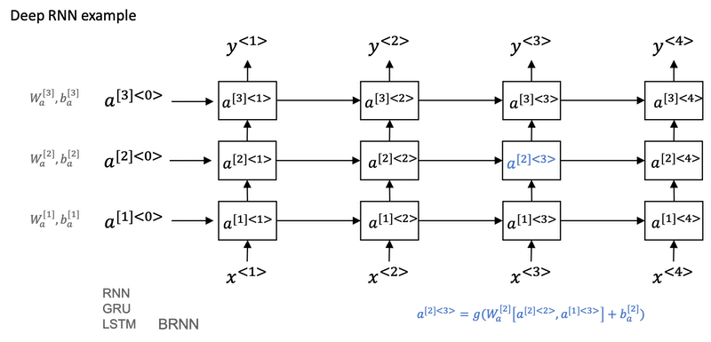

# Week 1: Recurrent Neural Network

>Recurrent neural networks has been proven to perform extremely well on temporal data. It has several variants including LSTMs, GRUs and Bidirectional RNNs.

## Why Sequence Models?

- Sequence Models like RNN and LSTMs have greatly transformed learning on sequences in the past few years.

- Examples of sequence data in applications:

  | **Application**            | **Type**             | **Input (X)**      | **Output(Y)**              |
  |----------------------------|----------------------|--------------------|----------------------------|
  | Speech Recognition         | Sequence-to-Sequence | Wave               | Text                       |
  | Music Generation           | One-to-Sequence      | Nothing or Integer | Wave                       |
  | Sentiment classification   | Sequence-to-One      | Text               | Integer Rating  from 1 - 5 |
  | DNA Sequence Analysis      | Sequence-to-Sequence | DNA Sequence       | DNA Labels                 |
  | Machine Translation        | Sequence-to-One      | Text               | Text                       |
  | Video Activity Recognition | Sequence-to-One      | Video Frames       | Label                      |
  | Name Entity Recognition    | Sequence-to-Sequence | Text               | Label                      |

- All of these problems with different input and output (sequence or not) can be addressed as supervised learning with label data X, Y as the training set.

## Why not a Standard Neural Network?
- **Variable Input and Output Lengths**
    - Standard NNs require fixed-size inputs/outputs.
    - However, in sequence tasks, the lengths of input/output can vary (e.g., sentences of different length) over examples, making it challenging to use a standard NN.
- **Lack of Contextual Awareness:**
    - Standard NN process inputs independently -- they cannot leverage the sequential context. For example, the meaning of word can depend on the words that come before or after it, which standard NN cannot capture.
- **Parameter Inefficiency**
    - A standard NN would require a large number of parameters to handle different input lengths, leading to inefficiency.
    - RNNs share parameters across time steps, reducing the number of parameters needed.

## Introduction to Recurrent Neural Networks

-   RNNs are designed to handle inputs and outputs of varying lengths, making them suitable for sequence learning tasks like name entity recognition.
-   Unlike standard NN, RNNs share parameters across time steps, allowing them to learn features that can generalize across different positions in the input sequence.

## Forward Propagation
-   In RNNs, each input word is processed sequentially, with the hidden state from the previous time step influencing the current prediction.
-   The activation function is applied to compute the hidden state and the output at each time step, using weights that are consistent across the sequence.

- In other words, the input sequence is processed from left to right, where each activation at a timestep depends on the previous activation and the input at that timestep.

-   The parameters used for these computations, such as weights and biases, remain constant across all timesteps.

    

    
- Instead of carrying around two parameter matrices Waa and Wax, we can simplifying the notation by compressing them into just one parameter matrix Wa.

    

**Limitations and Future Directions**
-   A key limitation of standard RNNs is their inability to utilize future context when making predictions, as they only consider past inputs.
-   This limitation can be addressed with bi-directional RNNs, allowing the model to incorporate information from both past and future inputs.

## Backpropagation Through Time (BPTT)

-   Backpropagation occurs in the opposite direction of forward propagation, moving from right to left through the network.
-   The overall loss for the sequence is calculated by summing the individual losses at each timestep, which is then used to update the parameters through gradient descent.

-   The term "backpropagation through time" describes this process, emphasizing the backward traversal through the sequence.
-   This method allows the network to learn from the entire sequence by adjusting weights based on the loss calculated at each timestep.

- **BPTT** is a specific method used to train RNNs. Here’s a concise breakdown:

    -   **Concept**: BPTT extends the standard backpropagation algorithm to handle the temporal aspect of RNNs. It allows the network to learn from sequences of data by considering the entire sequence during training.

    -   **Process**:  
        -   **Forward Pass**: The input sequence is processed from the first timestep to the last, generating activations and predictions at each timestep.
        -   **Loss Calculation**: After the forward pass, the loss is computed based on the predictions and the actual outputs at each time steps and summing them up.
        -   **Backward Pass**: The gradients of the loss with respect to the network's parameters are calculated by traversing back through the network, from the last timestep to the first. This involves accumulating gradients over all timesteps, allowing the model to learn from the entire sequence.
    -   **Purpose**: BPTT helps the RNN learn dependencies across time steps, making it effective for tasks like language modeling, where context from previous words influences the prediction of the next word.

## Different Types of RNNs
- There exists various architectures of RNNs that are  adjusted for different input and output sequence lengths.

- RNNs can have different configurations, such as many-to-many, many-to-one, one-to-many, and one-to-one, depending on the relationship between input and output sequences.

    

-  In `many-to-one` architecture, a sequence of words (input) can produce a single output, like a sentiment score for a movie review, e.g., sentiment classification.
-  In `one-to-many` architecture, e.g., music generation, it can take a single input (like a genre) and produce a sequence of musical notes.
- `Many-to-many` architectures can handle cases where the input and output lengths differ, such as in machine translation, where a sentence in one language may translate to a different number of words in another language.
    -   This involves an encoder-decoder structure, where the encoder processes the input sequence and the decoder generates the output sequence.

## Language Model and Sequence Generation

- A language model tells you what is the probability of a particular sentence.
- RNNs can be utilized to build effective language models in NLP.

- For example, we have two sentences from speech recognition application:

    | sentence | probability |
    | :---- | :---- |
    | The apple and pair salad. | 𝑃(The apple and pair salad)=3.2x10-13 |
    | The apple and pear salad. | 𝑃(The apple and pear salad)=5.7x10-10 |

- For language model it will be useful to represent a sentence as output `y` rather than inputs `x`. 

- So what the language model does is to estimate the probability of a particular sequence of words `𝑃(y<1>, y<2>, ..., y<T_y>)`.

    

**Understanding Language Models**

* A language model estimates the probability of a sequence of words, helping systems like speech recognition and machine translation determine the most likely sentence from similar-sounding options.
- For example, it can differentiate between "the apple and pair salad" and "the apple and pear salad" based on their probabilities.

**Building a Language Model with RNNs**

- To create a language model using an RNN, you need a large corpus of text, which is tokenized into a vocabulary, mapping words to one-hot vectors or indices.
- An end-of-sentence (EOS) token can be added to help the model understand when sentences conclude, although it may not be necessary for all applications.

**Training the RNN**

- The RNN processes the input sequence one word at a time, predicting the next word based on the previous words, and uses a Softmax function to output probabilities for each word in the vocabulary.

- The training involves defining a cost function based on the difference between the predicted and actual words, allowing the model to learn from its mistakes.

## Sampling Novel Sequences

After training a sequence model, you can evaluate its learning by generating novel sequences. Here's how to generate a sentence using an RNN language model:

**First Word Generation:**

- Use the softmax distribution to calculate probabilities for all possible first words (e.g., "a," "Aaron," "Zulu," <UNK>).
- Randomly sample the first word based on these probabilities using a method like `np.random.choice`.

**Subsequent Words:**

- Use the sampled word from the previous step as input to the next time step.
- Repeat the process to sample the next word until the <EOS> (end of sequence) token is generated or pre-specified number of words are generated.

**Avoiding <UNK> Tokens:**

- If <UNK> is sampled, reject it and resample until a valid word is selected.

This approach allows the model to generate sentences by sequentially sampling words based on learned probabilities.

#### Character Level Language Model

- A character-level language model generates sequences based on individual characters rather than whole words.

- **Advantages:**

  - Eliminates the need for an <UNK> token, as all characters are part of the vocabulary.

- **Disadvantages:**
  - Produces much longer sequences, making it harder to capture long-range dependencies in sentences.
  - More computationally expensive to train compared to word-level models.
  - While not as effective for capturing sentence-level context, character-level models are gaining interest in specific applications as computing power improves.

- **Character Level vs. Word Level Models**

    - A character level RNN uses individual characters as its vocabulary, allowing it to handle unknown words more effectively but resulting in longer sequences.
    - Word level models are generally more efficient for capturing long-range dependencies in sentences, while character level models can be more computationally expensive to train.

## Gated Recurrent Unit (GRU)
- Gated Recurrent Unit (GRU) is a modification of the basic RNN that enhances its ability to capture long-range dependencies and addresses the vanishing gradient problem.

    

- The GRU introduces a memory cell `c` to retain important information, such as whether a subject is singular or plural, throughout a sequence.  
- The update gate ($\Gamma_u$) controls when the memory cell should be updated, regulating the flow of information effectively.  
- $\hat{c}^{<t>}$ serves as the candidate for replacing $c^{<t>} = a^{<t>}$.  

- For intuition, $\Gamma_u$ can be thought of as being close to 0 or 1 most of the time, although in practice it is rarely exactly 0 or 1.  
- When $\Gamma_u$ is very close to 0 (e.g., \(0.000001\) or smaller), the GRU effectively avoids the vanishing gradient problem.  
- In such cases, $c^{<t>} \approx c^{<t-1>}$, allowing the memory value to remain stable over many time steps, which helps handle long-range dependencies in sequences.  

- The full GRU model also includes a reset gate $\Gamma_r$, where $\Gamma_r$ (relevance gate) determines how much of $c^{<t-1>}$ should be used to compute the next candidate for $c^{<t>}$.  

    

- **Implementation tips**
    
    - The asterisks represent element-wise multiplication.  
    - If the hidden activation value is 100-dimensional, then $c^{<t>}$, $\hat{c}^{<t>}$, and $\Gamma_u$ will also have the same dimension.  
    - If $\Gamma_u$ is a 100-dimensional vector, then it is really a 100 dimensional vector of bits, with values mostly close to 0 or 1.  
    - This vector determines which elements of the 100-dimensional memory cell should be updated. 
    - Element-wise multiplication allows the GRU to selectively update some bits while keeping others constant at each time step.  
    - In practice, the values in $\Gamma_u$ are not exactly 0 or 1 but are close to these extremes.  

## LSTM

- LSTMs are more complex than GRUs, featuring three gates: the update gate (\Gamma_u), the forget gate (\Gamma_f), and the output gate (~\Gamma_o). These gates enable more flexible and precise memory management.

- Unlike GRU, for LSTM, $c^<t> \neq a^{<t>}$

- Fancy explanation: [Understanding LSTM Network](http://colah.github.io/posts/2015-08-Understanding-LSTMs/)

    

- One notable feature of LSTMs is their ability to preserve information over long sequences.  
- By appropriately setting the forget and update gates, an initial value $c^{<0>}$ can be easily passed through the memory cell to later timesteps, such as $c^{<3>} = c^{<0>}$.  
- This capability allows the LSTM, and similarly the GRU, to effectively memorize specific values over long durations.  
- It ensures that certain real-valued information remains stored in the memory cell, even across many timesteps.  

    

- The equations for LSTMs differ from GRUs, particularly in how memory cell updates are handled. LSTMs include separate gates for updating and forgetting information, offering greater control.

- LSTMs excel at maintaining information over long periods, making them well-suited for tasks requiring memory of earlier inputs.

- **Peephole Connections:** A common variation of LSTMs incorporates peephole connections, where the previous memory cell value influences the gate calculations, enhancing performance in certain tasks.

- **Choosing Between LSTM and GRU**

    - There is no universally superior choice between LSTMs and their variants. GRUs are simpler and better suited for building larger networks, while LSTMs offer greater power and flexibility for a wider range of tasks.

    - **LSTMs:** Historically more proven and versatile, are powerful for tasks with complex memory requirements.  

    - **GRUs:**  Simpler and more efficient, GRUs can be easier to scale for larger models.  

    - **Decision Factors:**  The choice between LSTMs and GRUs depends on the specific problem. Each architecture has advantages suited to different use cases.
    

## Bidirectional RNN

- Bidirectional RNNs and Deep RNNs allow you to build more powerful sequence models.

    

- A bidirectional RNN allows the model to access information from both earlier and later parts of a sequence, enhancing its predictive capabilities.
This is particularly useful in tasks like named entity recognition, where context from both directions is essential for accurate predictions.

- The architecture consists of two recurrent components: a forward RNN and a backward RNN, each processing the input sequence in opposite directions.
- Predictions are made by combining the activations from both the forward and backward passes, allowing the model to consider the entire context of the sequence.

- Bidirectional RNNs are commonly used in natural language processing (NLP) tasks, especially with LSTM blocks for better performance.
- A key limitation is that the entire sequence must be available before making predictions, which can be challenging in real-time applications like speech recognition.
- The blocks here can be any RNN block including the basic RNNs, LSTMs, or GRUs.

## Deep RNN

- **Definition and Purpose:** Deep RNNs are built by stacking multiple layers of RNNs, enabling deeper learning and the approximation of more complex functions.  

- **Layer Parameters and Activations:** Each layer has its own set of parameters. Activations are represented with a notation that indicates both the layer number and the time step.  

- **Activation Calculation:**  The activation of a layer is computed using inputs from the previous layer and the current time step. A weighted sum of these inputs is passed through an activation function.  

- **Layer Depth:** While standard RNNs can have many layers, deep RNNs often have fewer due to computational complexity and the additional temporal dimension.  

- **Network Architecture Variations**
    - **Recurrent Units:** 
        - Deep RNNs can use different types of recurrent units, such as GRUs and LSTMs.  
        - Some architectures include bidirectional connections for improved context understanding.  

    - **Stacked Architectures:**  
        - A common design involves stacking recurrent layers, followed by deep networks that handle predictions.  
        - This structure allows for flexibility in model design.  