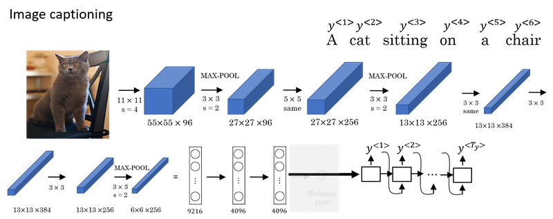
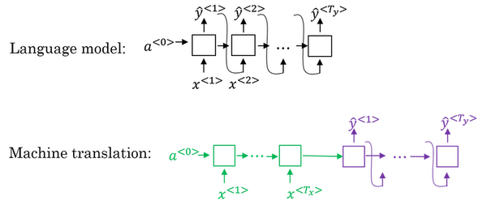
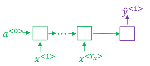
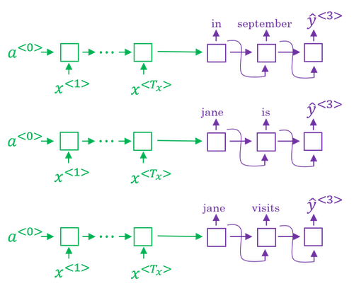
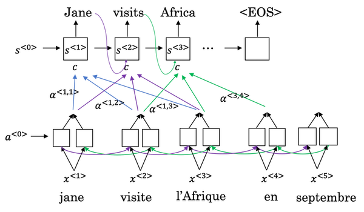
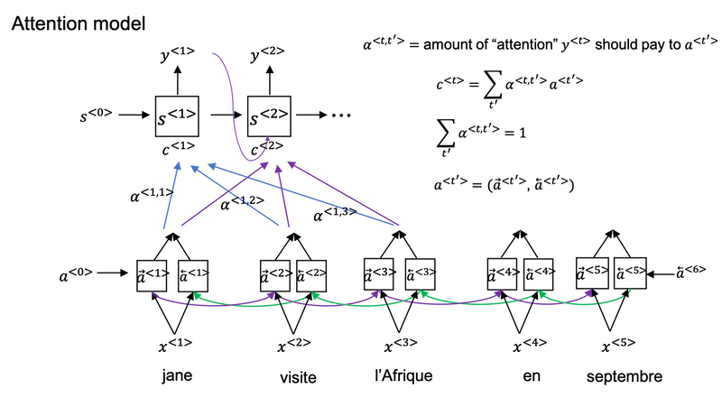
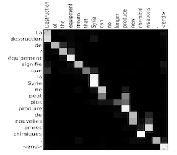

# Week 3: Sequence models & Attention mechanism
- [Various Sequence-to-Sequence Architectures](#various-sequence-to-sequence-architectures)
  - [Basic Models](#basic-models)
  - [Picking the most likely sentence](#picking-the-most-likely-sentence)
  - [Beam Search](#beam-search)
  - [Refinements to Beam Search](#refinements-to-beam-search)
  - [Error analysis in beam search](#error-analysis-in-beam-search)
  - [Bleu Score (optional)](#bleu-score-optional)
  - [Attention Model Intuition](#attention-model-intuition)
  - [Attention Model](#attention-model)
- [Speech recognition - Audio data](#speech-recognition---audio-data)
  - [Speech recognition](#speech-recognition)
  - [Trigger Word Detection](#trigger-word-detection)

>Sequence models can be augmented using an attention mechanism. This algorithm will help your model understand where it should focus its attention given a sequence of inputs. In this section, we will also learn about speech recognition and how to deal with audio data.

## Various Sequence-to-Sequence Architectures

### Basic Models

* **Sequence to sequence models** are essential for applications like **machine translation** and **speech recognition**.

* They typically have **Encoder-Decoder architecture* and consists of two main components -- *encoder* and *decoder*.

* **Example 1: Machine Translation**

  - The *encoder* is responsible for processing input sequence (e.g., a sentence in French) and compressing this information into a fixed-size "context" or "encoding" vector. It is usually an RNN (like a GRU or LSTM)
  - The vector produced by the *encoder* is fed into the *decoder*, which then produces output sequence (e.g., translated sentence in English), one token at a time. It is also an RNN, which uses output context vector from the *encoder* as its initial state, and then starts generating the output sequence until "end of sequence" token is generated.
  
  

  - Papers
  - *Sequence to sequence learning with neural networks*, Sutskever et al., 2014
  - *Learning phrase representations using RNN encoder-decoder for statistical machine translation*, Cho et al., 2014

* **Example 2: Image Captioning**
  - Sequence-to-Sequence models can be adapted for image captioning, where the input is an image, and the output is a descriptive caption.
  - The *encoder* in this setting is a pre-trained CNN (e.g., AlexNet w/o final Softmax unit). It processes the image to produce a feature vector, capturing the image's essence.
  - This feature vector is fed to an RNN-based *decoder*, which then generates a relevant caption for the image.

  

- Papers
  - Deep captioning with multimodal recurrent neural network, Mao, et al., 2014
  - Show and tell: Neural image caption generator, Vinyale et al., 2014

### Picking the most likely sentence

There are some similarities between the sequence to sequence machine translation model and the language models that you have worked within the first week of this course, but there are some significant differences as well.

- The machine translation is very similar to a **conditional** language model.
  - You can use a language model to estimate the probability of a sentence.
  - The decoder network of the machine translation model looks pretty much identical to the language model, except that instead of always starting along with the vector of all zeros, it has an encoder network that figures out some representation for the input sentence.
  - Instead of modeling the probability of any sentence, it is now modeling the probability of the output English translation conditioned on some input French sentence. In other words, you're trying to estimate the probability of an English translation.
  
    
  
- The difference between machine translation and the earlier language model problem is: rather than wanting to generate a sentence at random, you may want to try to find the most likely English translation.
- In developing a machine translation system, one of the things you need to do is come up with an algorithm that can actually find the value of y that maximizes p(y\<1>,...,y\<T_y>|x\<1>,...,x\<T_x>). The most common algorithm for doing this is called **beam search**.
  - The set of all English sentences of a certain length is too large to exhaustively enumerate. The total number of combinations of words in the English sentence is exponentially larger. So it turns out that the greedy approach, where you just pick the best first word, and then, after having picked the best first word, try to pick the best second word, and then, after that, try to pick the best third word, that approach doesn't really work.
  - The most common thing to do is use an approximate search out of them. And, what an approximate search algorithm does, is it will try, it won't always succeed, but it will to pick the sentence, y, that maximizes that conditional probability.

### Beam Search
- Beam Search algorithm is a method used in machine translation and speech recognition to find the most likely output sequence. 

- **Purpose**: Beam Search aims to output the best translation or transcript by considering multiple possibilities at each step, unlike greedy search which only considers the most likely option.

- **Beam Width (B)**: This parameter determines how many alternatives are considered at each step. For example, a beam width of 3 means the algorithm keeps track of the top three possibilities.

- **Process**:
  - The algorithm starts by evaluating the first word's probabilities based on the input sentence.
  - It then considers the second word for each of the first word choices, calculating the combined probabilities.
  - This process continues for subsequent words, narrowing down the options at each step while maintaining the beam width.
- **Outcome**: By the end of the process, Beam Search typically finds a better output than greedy search by evaluating multiple paths simultaneously.

== 
In the example of the French sentence, `"Jane, visite l'Afrique en Septembre"`.

Start by selecting the first word for the English translation using beam width B=3.
Process the input sentence through the encoder and decode the first step to produce probabilities for all 10,000 vocabulary words.
Retain the top three most likely words (e.g., in, Jane, September) for further exploration in the beam search.

- **Step 1**: Begin by selecting the first word of the English translation. Set the beam width `B=3`.
  - Identify the top three most likely candidates for the first word in the English output. 
  - Specifically, process the input French sentence through the encoder network. In the first decoding step, the network produces a softmax output over all 10,000 possible words (assuming a vocabulary size of 10,000).
  - From these 10,000 outputs p(y\<1>|x), retain the top three highest probability words (say `in`, `Jane`, and `September`).
    
  
- **Step 2**: Determine the next word.

  - Identify the most likely pair of the first and second words, rather than considering the second word alone.
  - Use conditional probability: p(y\<1>,y\<2>|x) = p(y\<1>|x) * p(y\<2>|x,y\<1>)

  - After this step, candidates like `in September`, `Jane is`, and `Jane visit` remain, with `September` eliminated as a first-word candidate.
  - Since the beam width is 3, instantiate three copies of the network to evaluate these partial sentence fragments and their outputs.
  - Repeat this process until the end-of-sentence symbol is generated.

  
- If beam width is 1, this essentially becomes the greedy search algorithm.

### Refinements to Beam Search

- **Length normalization:**
  - Beam search is to maximize the probability:
    $$\mathop{\text{arg\space max}}\limits_{y} p(y^{<1>}, ..., p(y^{<T_y>}|x) = \mathop{\text{arg\space max}}\limits_{y} \prod\limits_{t = 1}^{T_y}p(y^{<t>}|x, y^{<1>}, ..., y^{<t - 1>})$$
    
  
  - However, multiplying a lot of numbers less than 1 will result in a very tiny number, which can result in numerical underflow.
  - So instead, we maximize a log version:

  $$\mathop{\text{arg\space max}}\limits_{y}\large\sum\limits_{t = 1}^{T_y}\log p(y^{<t>}|x, y^{<1>}, ..., y^{<t - 1>})$$  
  
  
  - If you have a very long sentence, the probability of that sentence is going to be low, because you're multiplying many terms less than 1. And so the objective function (the original version as well as the log version) has an undesirable effect, that maybe it unnaturally tends to prefer very short translations. It tends to prefer very short outputs.
  - A normalized log-likelihood objective:
  
    $$\mathop{\text{arg\space max}}\limits_{y}\dfrac{1}{T_y^{\alpha}}\large\sum\limits_{t = 1}^{T_y}\log p(y^{<t>}|x, y^{<1>}, ..., y^{<t - 1>})$$  

    - $\alpha\rightarrow$ another hyperparameter
    - $\alpha=0\rightarrow$ no normalizing
    - $\alpha=1\rightarrow$ full normalization

- **Choosing Beam Width (\( B \))**  

  - *Large Beam Width:*  
    - Explores more possibilities, often resulting in better outcomes.  
    - Increases computational cost and memory usage, slowing down the process.  

  - *Small Beam Width:*  
    - Reduces computational and memory requirements, leading to faster execution.  
    - May produce worse results due to fewer explored possibilities.  

  - *Practical Considerations:*  
    - The choice of $B$ depends on the application and domain.  
    - In production systems, $B = 10$ is common, while $B = 100$ is less frequent.  
    - For research, larger values like $B = 1000$ or $B = 3000$ may be used, but diminishing returns are common with very large $B$.  

  - *Comparison with Other Search Algorithms*  
    - Beam search is faster than exact search methods like BFS (Breadth-First Search) or DFS (Depth-First Search).  
    - However, it does not guarantee finding the exact maximum for $ \mathop{\text{arg\space max}}\limits_y \, P(y|x) $.  

### Error analysis in beam search

- Beam search is an approximate or heuristic search algorithm, meaning it does not always produce the most likely sentence.  

- To determine whether performance issues are due to the beam search algorithm or the RNN model, conduct error analysis. This helps decide where to focus your efforts for improvement.  

- **Limitations of Simple Adjustments:** Increasing the beam width or adding more training data may not always lead to the desired performance.  

- Break down the problem to identify the most effective way to allocate your time and resources.  

- *The error analysis process:*
  - Problem:
    - To translate: `Jane visite l’Afrique en septembre.` (x)
    - Human: `Jane visits Africa in September.` (y*)
    - Algorithm: `Jane visited Africa last September.` (y&#770;) which has some error.
  - Analysis:
    - Case 1:
      | Human | Algorithm | p(y*\|x) vs p(y&#770;\|x) | At fault? |
      | :---: | :-------: | :--------------------------------: | :-------: |
      | Jane visits Africa in September. | Jane visited Africa last September. | p(y*\|x) > p(y&#770;\|x) | Beam search |
      | ... | ... | ... | ... |
    - Case 2:
      | Human | Algorithm | p(y*\|x) vs p(y&#770;\|x) | At fault? |
      | :---: | :-------: | :--------------------------------: | :-------: |
      | Jane visits Africa in September. | Jane visited Africa last September. | p(y*\|x) ≤ p(y&#770;\|x) | RNN |
      | ... | ... | ... | ... |

### Bleu Score (optional)

- Paper: [BLEU: a Method for Automatic Evaluation of Machine Translation](https://www.aclweb.org/anthology/P02-1040.pdf) by Kishore Papineni, Salim Roukos, Todd Ward, and Wei-Jing Zhu.

- BLEU score, a conventional metric used to evaluate machine translation systems. Here are the key points:

- **Challenge in Machine Translation**: Multiple valid translations exist for a single sentence, making accuracy measurement complex.

- **BLEU Score**: Stands for *Bilingual Evaluation Understudy*, a conventional metric used to evaluate machine generated translations, by comparing them to human-generated references.

- **Precision Measurement**: The BLEU score uses modified precision, which counts how many words or n-grams (pairs or triples of words) in the machine output appear in the references, with a cap on how many times a word can be counted based on its occurrences in the references.

  - An extreme example:
    - French: `Le chat est sur le tapis.`
    - Reference 1: `The cat is on the mat.`
    - Reference 2: `There is a cat on the mat.`
    - MT output: `the the the the the the the.`
   - Modified precision: 2/7 (not 7/7). The numerator is the count of the number of times the word, `the`, appears. We take a max, we clip this count, at 2.

- In the BLEU score, you don't want to just look at isolated words. You maybe want to look at pairs of words as well. Let's define a portion of the BLEU score on bigrams.
- MT output: `The cat the cat on the mat.`

    | Bigram | Count | Countclip |
    | :----- | :---: | :----: |
    | the cat | 2 | 1 |
    | cat the | 1 | 0 |
    | cat on | 1 | 1 |
    | on the | 1 | 1 |
    | the mat | 1 | 1 |
    | *sum* | 6 | 4 |

  - Modified bigram precision: 4/6

- Generally, Bleu score on *n-grams* is defined as:

$$p_n = \dfrac{\sum\limits_{\text{n}gram \in \hat{y}} count_{clip}(\text{n}gram)}{\sum\limits_{\text{n}gram \in \hat{y}} count(\text{n}gram)}$$

- **Final BLEU Score Calculation**: Combines precision scores for unigrams, bigrams, trigrams, and four-grams, adjusted by the brevity penalty to produce a single score.

- **Combined/Final Bleu score:** $\text{BP}*{\exp}\left(\frac{1}{4}\sum\limits_{n = 1}^{4}p_n\right)$

  - BP is for **brevity penalty**. Preventing short sentences from scoring too high. This adjustment penalizes translations that are too short, ensuring that longer, more complete translations are favored.

  - `BP = 1`, if `MT_output_length > reference_output_length`, or
  - `BP = exp⁡(1 − reference_output_length / MT_output_length)`, otherwise, which penalizes shorter translation.

- The BLEU score is widely used in evaluating various text generation systems, including machine translation and image captioning.

### Attention Model Intuition

- Paper: [Neural Machine Translation by Jointly Learning to Align and Translate](https://arxiv.org/abs/1409.0473) by Dzmitry Bahdanau, Kyunghyun Cho, Yoshua Bengio.

- So far, we have used an *Encoder-Decoder* architecture for machine translation, where one RNN processes the input sentence, and another RNN generates the output sentence. A modification to this approach, called the **Attention Model**, significantly improves its performance.

- **Human Approach vs. Machine Translation**

  > **French Sentence:**  Jane s'est rendue en Afrique en septembre dernier, a apprécié la culture et a rencontré beaucoup de gens merveilleux; elle est revenue en parlant comment son voyage était merveilleux, et elle me tente d'y aller aussi.* 

  > **English Translation:**  Jane went to Africa last September, and enjoyed the culture and met many wonderful people; she came back raving about how wonderful her trip was, and is tempting me to go too.* 

  - A human translator does not translate by memorizing the entire French sentence and then recreating the English translation from scratch.  
  - Instead, the process involves:  
    - Reading a portion of the French sentence.  
    - Generating a corresponding part of the English translation.  
    - Continuously alternating between reading and generating until the translation is complete.  

  - This incremental approach aligns with how attention mechanisms in machine translation models process and translate text.  

- The **Encoder-Decoder architecture** performs well for short sentences, achieving relatively high BLEU scores.  
- However, its performance declines significantly for longer sentences, typically those exceeding 30 or 40 words. *(Represented by the blue line.)*  

  

- The **Attention model** translates more like humans, focusing on one part of the sentence at a time.  
- With this approach, machine translation performance improves significantly and is represented by the green line above.  

- The **Attention Model** computes a set of attention weights to decide how much focus to give to different parts of the input sentence while generating the translation/output.  
  - For example, $ \alpha^{<1,1>} $ indicates how much attention is paid to the first input word when generating the first output word.  
  - Similarly, $ \alpha^{<1,2>} $ shows how much focus is on the second input word, and $ \alpha^{<1,3>} $ for the third, and so on.  

- These weights together form the **context vector** `C`, which guides the RNN in generating the next word in the output.  

- The RNN continues step by step, using these attention weights $\alpha^{<t,t'>}$ at each step to determine how much focus to place on each input word while generating the $t$-th word in the output. This process repeats until the `<EOS>` (end-of-sentence) token is generated.  

### Attention Model
- Assume you have an input sentence and use a bidirectional RNN, GRU, or LSTM to compute features for each word. In practice, GRUs and LSTMs are commonly used, with LSTMs being slightly more prevalent. The notation for the Attention model is illustrated below.  

  

- Attention weights are computed as:

$$\alpha^{<t, t'>} = \dfrac{\exp(e^{<t, t'>})}{{\large\sum\limits_{t'=1}^{T_x}}\exp(e^{<t, t'>})}$$

- To compute $e^{<t,t'>}$ using a small neural network:  
  - The intuition is that the attention weight should primarily depend on:  
    - $s^{<t-1>}$: The hidden state activation from the previous time step.  
    - $a^{<t'>}$: The features from time step $t'$.  

  - It makes sense that $\alpha^{<t,t'>}$ and $e^{<t,t'>}$ should depend on $s^{<t-1>}$ and $a^{<t'>}$, but the exact function to compute this is unknown.  

  - A practical solution is to train a small neural network to learn this function. Backpropagation and gradient descent will optimize the network to discover the appropriate relationship.  

    

- A drawback of this algorithm is its quadratic time and computational cost.  
- If there are $T_x$ words in the input and $T_y$ words in the output, the total number of attention parameters are going to be $T_x * T_y$

- Visualize the attention weights $\alpha^{<t, t'>}$:

  

*Implementation tips*:

* The diagram on the left shows the attention model.
* The diagram on the right shows what one "attention" step does to calculate the attention variables 𝛼\<t,t'>.
* The attention variables 𝛼\<t,t'> are used to compute the context variable context\<t> for each timestep in the output (t=1, ..., Ty).

<table>
<td> 
  
</td> 
<td> 
  
</td> 
</table>
<caption>
Neural machine translation with attention
</caption>

## Speech recognition - Audio data

### Speech recognition

- In this section, we focus on speech recognition using sequence-to-sequence models. 
- Speech Recognition involves taking an audio clip ($x$) as input and automatically generating a corresponding text transcript ($y$).  

- **Audio Representation**: Audio is represented as changes in air pressure over time, often visualized as a spectrogram.

- **Historical Approach**
  - Traditional speech recognition systems relied on *phonemes*, which were hand-engineered basic units of sound.  
  - Linguists believed that representing audio in terms of phonemes was the most effective way to perform speech recognition.  

- **Advancements with End-to-End Deep Learning:**  
  - Modern speech recognition systems no longer require phoneme representations.  
  - Instead, they process audio clips directly to generate transcripts, eliminating the need for hand-engineered features.  
  - This shift has been enabled by the availability of much larger datasets.  

- **Dataset Sizes:**  
  - Academic datasets typically range from 300 hours to 3000 hours of transcribed audio.  
  - Commercial systems, however, are trained on datasets exceeding 10,000 hours, with some using over 100,000 hours of audio.  

### How to build a speech recognition?

- **Attention Model for Speech Recognition** An attention model can be used to process the audio input along the horizontal axis (time frames) and generate the corresponding transcript, such as "the quick brown fox."  

    

- **CTC (Connectionist Temporal Classification) for Speech Recognition** 
  - **CTC Cost Function:**  
    - Developed in the paper: [Connectionist Temporal Classification: Labelling Unsegmented Sequence Data with Recurrent Neural Networks](https://www.cs.toronto.edu/~graves/icml_2006.pdf) by Alex Graves, Santiago Fernandes, Faustino Gomez, and Jürgen Schmidhuber.  

      

  - **RNN Architecture:**  
    - Although the illustration shows a simple uni-directional RNN, practical systems typically use bidirectional LSTMs or GRUs in deeper models.  
    - In speech recognition, the input sequence (time frames) is usually much longer than the output sequence (characters).  
      - Example: A 10-second audio clip sampled at 100 Hz results in 1000 input time steps, but the output might only contain a few dozen characters.  

  - **How CTC Works?**  
    - The CTC cost function allows the RNN to generate sequences with repeated characters and special symbols:  
      - Example output: `ttt_h_eee___[]___qqq__`, where `_` represents "blank" and `[]` represents "space."  
    - **Basic Rule:** Collapse repeated characters that are not separated by "blank." This ensures a clean transcription from the generated sequence.  

### Trigger Word Detection

- *Trigger word detection* systems, aka *wake word detection systems*, allow devices to be activated by specific voice commands.  

- The field of trigger word detection is evolving, with no universal consensus on the best algorithm.  
- RNN-based approaches are common, where audio features (e.g., spectrograms) are extracted and passed through an RNN to predict trigger words.  

- **Pre-Processing:** Compute spectrogram features and optionally use a 1D convolutional layer before passing data to an RNN, GRU, or LSTM.  

- **Applications** 
  - Commonly used in virtual assistants (e.g., Siri, Google Home) and smart devices.
  - When a user says a designated trigger word (like "Alexa" for Amazon Echo), the device becomes active and ready to respond to further commands. -->

- This technology enables hands-free interaction with devices, enhancing user convenience and accessibility.

*Notes by Aaron@2020 and revised by Prakash@2025*

